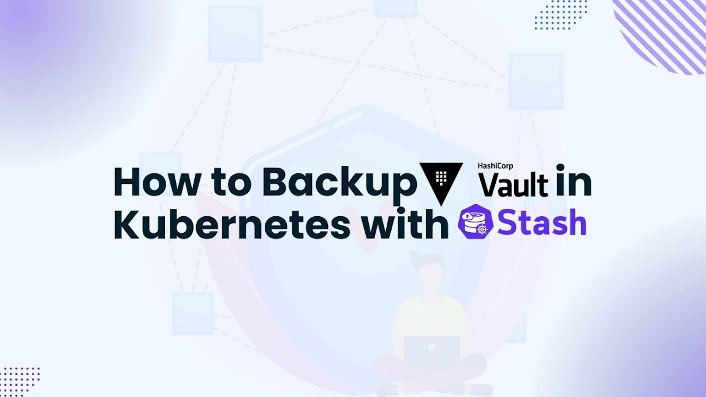

# How to Backup Vault in Kubernetes with Stash



In today's cloud-native world, securing sensitive data like API keys, passwords, and certificates is crucial. [HashiCorp Vault](https://developer.hashicorp.com/vault) provides powerful secret management capabilities. Hashicorp's Vault can be deployed and configured on Kubernetes with [KubeVault](https://kubevault.com/), a production-grade Kubernetes operator solution. For cloud-native apps, it ensures automation, scalability, and security while streamlining secret management. Additionally, [Stash](https://stash.run/) provides a Kubernetes-native backup and restoration solution for Vault data, guaranteeing disaster recovery and data durability.

This article will demonstrate how to use Stash and KubeVault to backup Vault in Kubernetes cluster. Whether your position is security professional, cloud architect, or DevOps engineer, this detailed guide will enable you to create a strong disaster recovery system for your secret management solution in Kubernetes.

## Deploy Vault on Kubernetes

To backup vault in kubernetes, first we need to have a vault server running inside our Kubernetes cluster.

### Pre-requisites
First, we need to set up the environment, and then we can use KubeVault to deploy a vault server. You need to have a Kubernetes cluster. You should understand the basics of Kubernetes concepts like cluster, pod, service, and secret. You should also be familiar with [Vault](https://www.vaultproject.io/). Here, our Kubernetes cluster will be created using [Kind](https://kubernetes.io/docs/tasks/tools/#kind). Additionally, [Helm](https://helm.sh/docs/intro/install/) needs to be installed on our Kubernetes cluster.  Basic knowledge of various Kubernetes concepts are required, for example, pod, service, secret, cluster, and also have a basic idea about HashiCorp Vault.

In this article, Vault server will be deployed using KubeVault. For that, it is required to install the KubeVault operator in your Kubernetes cluster. A license is required to use KubeVault on a Kubernetes cluster, and it is available for free from the [Appscode License Server](https://appscode.com/issue-license/). The Kubernetes cluster ID is required in order to obtain this license. You can use the command we've included below to find this ID.
 
```bash
$ kubectl get ns kube-system -o jsonpath='{.metadata.uid}'
e5b4a1a0-5a67-4657-b370-db7200108cae
```

After providing the necessary information and hitting the submit button, the license server will email a "license.txt" file. To install KubeVault, run the following commands:

```bash
$ helm install kubevault oci://ghcr.io/appscode-charts/kubevault \
  --version v2025.2.10 \
  --namespace kubevault --create-namespace \
  --set-file global.license=/path/to/the/license.txt \
  --wait --burst-limit=10000 --debug
```

Verify the installation by the following command:

```bash
$ kubectl get pods --all-namespaces -l "app.kubernetes.io/instance=kubevault"
NAMESPACE   NAME                                                  READY   STATUS    RESTARTS   AGE
kubevault   kubevault-kubevault-operator-f89555d55-rwf49          1/1     Running   0          64m
kubevault   kubevault-kubevault-webhook-server-6497bb6d69-4wvpr   1/1     Running   0          64m
``` 
Within a short time all the pods in kubevault namespace will start running. If all pod statuses are running, we can move on to the next phase.

For any confusion regarding KubeVault installation, you can follow the [KubeVault-Setup](https://kubevault.com/docs/latest/setup/) page.

Also, install Stash in your cluster following the steps [here](https://stash.run/docs/v2024.4.8/setup/install/stash/).

### Create a Namespace
After that, we'll create a new namespace in which we will deploy Vault Server. In this case, we have created demo namespace, but you can create namespace with any name that you want. To create the namespace, we can use the following command:

```bash
$ kubectl create namespace demo
namespace/demo created
``` 

### Deploy VaultServer with KubeVault operator
First, we need to create a yaml configuration that will be used to deploy HashiCorp Vault Server on Kubernetes. Many Storage Backend types for Vault Server are supported by KubeVault. Integrated Storage (aka Raft) and Consul are two storage backend types that are recommended.

We will apply the following yaml of vault server which uses raft as the storage backend:

```yaml
apiVersion: kubevault.com/v1alpha2
kind: VaultServer
metadata:
  name: vault
  namespace: demo
spec:
  allowedSecretEngines:
    namespaces:
      from: All
  version: 1.18.4
  replicas: 3
  backend:
    raft:
      storage:
        storageClassName: "standard"
        resources:
          requests:
            storage: 1Gi
  unsealer:
    secretShares: 5
    secretThreshold: 3
    mode:
      kubernetesSecret:
        secretName: vault-keys
  terminationPolicy: WipeOut
```

In this yaml,

- `spec.replicas` specifies the number of Vault nodes to deploy. It has to be a positive number. Note: Amazon EKS does not support HA for Vault. As we using Amazon EKS as our backend it has to be 1.
- `spec.version` specifies the name of the VaultServerVersion CRD. This CRD holds the image name and version of the Vault, Unsealer, and Exporter.
- `spec.allowedSecretEngines` defines the Secret Engine informations which to be granted in this Vault Server.
- `spec.backend` is a required field that contains the Vault backend storage configuration.
- `spec.unsealer` specifies Unsealer configuration. Unsealer handles automatic initializing and unsealing of Vault.
- `spec.terminationPolicy` field is Wipeout means that vault will be deleted without restrictions. It can also be “Halt”, “Delete” and “DoNotTerminate”. Learn More about these [HERE](https://kubevault.com/docs/v2025.2.10/concepts/vault-server-crds/vaultserver/#specterminationpolicy).

We will save this yaml configuration to `vault.yaml`. Then create the above HashiCorp Vault Server object.

```bash
$ kubectl create -f vault.yaml
vaultserver.kubevault.com/vault created
```

This will create a `VaultServer` custom resource. The KubeVault Kubernetes Operator will watch this and create three HashiCorp Vault Server pods in the specified namespace.
If all the above steps are handled correctly and the Vault is deployed, you will see that the following objects are created:

```bash
$ kubectl get all -n demo
NAME          READY   STATUS    RESTARTS   AGE
pod/vault-0   2/2     Running   0          4m7s
pod/vault-1   2/2     Running   0          3m38s
pod/vault-2   2/2     Running   0          3m19s

NAME                                       TYPE          VERSION   AGE
appbinding.appcatalog.appscode.com/vault   VaultServer   1.12.1    4m7s

NAME                              REPLICAS   VERSION   STATUS   AGE
vaultserver.kubevault.com/vault   3          1.12.1    Ready    4m31s

NAME                                                            STATUS    AGE
vaultpolicy.policy.kubevault.com/vault-auth-method-controller   Success   2m55s

NAME                                                                   STATUS    AGE
vaultpolicybinding.policy.kubevault.com/vault-auth-method-controller   Success   2m53s
```

We have successfully deployed Vault in Kubernetes with the Kubernetes KubeVault operator. Now, we will connect to the deployed Vault Server and verify whether it is usable or not. First, check the status,

```bash
$ kubectl get vaultserver -n demo
NAME    REPLICAS   VERSION   STATUS   AGE
vault   3          1.12.1    Ready    5m48s
```

From the output above, we can see that the `VaultServer` is ready to use. 

### Accessing Vault Server Through CLI

We will connect to the Vault by using Vault CLI. Therefore, we need to export the necessary environment variables and port-forward the service.

In one terminal port-forward the vault server service,

```bash
kubectl port-forward -n demo service/vault 8200
Forwarding from 127.0.0.1:8200 -> 8200
Forwarding from [::1]:8200 -> 8200
```

We will connect to the HashiCorp Vault Server by using Vault CLI. Therefore, we need to export the necessary environment variables. So, in another terminal export the environment variables and interact with the vault server with Vault CLI,
```bash
$ export VAULT_ADDR=http://127.0.0.1:8200
$ export VAULT_TOKEN=(kubectl vault root-token get vaultserver vault -n demo --value-only)

##Check Vault Status
$ vault status
Key                     Value
---                     -----
Seal Type               shamir
Initialized             true
Sealed                  false
Total Shares            5
Threshold               3
Version                 1.12.1
Build Date              2022-10-27T12:32:05Z
Storage Type            raft
Cluster Name            vault-cluster-b199935d
Cluster ID              5549e2d1-0181-0bfb-752b-59f94dac3325
HA Enabled              true
HA Cluster              https://vault-0.vault-internal:8201
HA Mode                 active
Active Since            2025-03-20T05:35:11.913829478Z
Raft Committed Index    429
Raft Applied Index      429
```

### Enabling KV SecretEngine

At this stage, we've successfully deployed `Vault` using `KubeVault` operator & ready for taking `Backup`.

Before, to backup vault in kubernetes, let's write some data in a `KV` secret engine. Let's export the necessary environment variables & port-forward from `vault` service or exec into the vault pod in order to interact with it.

In the same terminal, let's go ahead create a [KV SecretEngine](https://developer.hashicorp.com/vault/docs/secrets/kv) in the HashiCorp VaultServer,
```bash
$ vault secrets enable -path=demo -version=2 kv
vault secrets enable -path=demo -version=2 kv

$ vault kv put demo/db-cred username=appscode password=kubevault
===== Secret Path =====
demo/data/db-cred

======= Metadata =======
Key                Value
---                -----
created_time       2025-03-20T05:47:25.811616153Z
custom_metadata    <nil>
deletion_time      n/a
destroyed          false
version            1

$ vault kv get demo/db-cred
===== Secret Path =====
demo/data/db-cred

======= Metadata =======
Key                Value
---                -----
created_time       2025-03-20T05:47:25.811616153Z
custom_metadata    <nil>
deletion_time      n/a
destroyed          false
version            1

====== Data ======
Key         Value
---         -----
password    kubevault
username    appscode
```

From the commands above we can see that Vault Server is working seamlessly. First, we have enabled a kv secret engine in the HashiCorp Vault Server. Then wrote and read some data in that secret engine.

## Backup Vault in Kubernetes

### Prepare Backend

We are going to store our backed up data into a GCS bucket. We have to create a Secret with necessary credentials and a Repository crd to use this backend. If you want to use a different backend,
please read the respective backend configuration doc from [here](https://stash.run/docs/v2022.12.11/guides/backends/overview/).

#### Create Secret

Let’s create a secret called `gcs-secret` with access credentials to our desired GCS bucket,

```bash
$ echo -n 'restic-pass' > RESTIC_PASSWORD
$ echo -n 'project-id' > GOOGLE_PROJECT_ID
$ cat sa.json > GOOGLE_SERVICE_ACCOUNT_JSON_KEY

$ kubectl create secret generic -n demo gcs-secret \
    --from-file=./RESTIC_PASSWORD \
    --from-file=./GOOGLE_PROJECT_ID \
    --from-file=./GOOGLE_SERVICE_ACCOUNT_JSON_KEY
```

Now, we are ready to backup our workload’s data to our desired backend.

#### Create Repository

Now, create a `Repository` using this secret. Below is the YAML of Repository crd we are going to create,

```yaml
apiVersion: stash.appscode.com/v1alpha1
kind: Repository
metadata:
  name: gcp-demo-repo
  namespace: demo
spec:
  backend:
    gcs:
      bucket: stash-testing
      prefix: demo-vault
    storageSecretName: gcs-secret
  usagePolicy:
    allowedNamespaces:
      from: Same
  wipeOut: false
```

```bash
$ kbuectl apply -f repository.yaml
```

Now, we are ready to backup our sample data into this backend.

### Backup

We have to create a BackupConfiguration crd targeting the stash-demo StatefulSet that we have deployed earlier.
Stash will inject a sidecar container into the target. It will also create a CronJob to take periodic
backup of /source/data directory of the target.

#### Create BackupConfiguration

Below is the YAML of the BackupConfiguration crd that we are going to create,

```yaml
apiVersion: stash.appscode.com/v1beta1
kind: BackupConfiguration
metadata:
  name: demo-backup
  namespace: demo
spec:
  driver: Restic
  repository:
    name: gcp-demo-repo
    namespace: demo
  schedule: "*/5 * * * *"
  timeOut: 2h
  target:
    ref:
      apiVersion: appcatalog.appscode.com/v1alpha1
      kind: AppBinding
      name: vault
  runtimeSettings:
    container:
      securityContext:
        runAsUser: 0
        runAsGroup: 0
  retentionPolicy:
    name: 'keep-last-5'
    keepLast: 5
    prune: true
```

Here,
- `spec.repository` refers to the Repository object gcs-repo that holds backend information.
- `spec.schedule` is a cron expression that indicates `BackupSession` will be created at 5 minute interval.
- `spec.target.ref` refers to the `AppBinding` of the `VaultServer`.

Let’s create the BackupConfiguration crd we have shown above,

```bash
$ kubectl apply -f backup-configuration.yaml
```

#### Verify Backup Setup Successful

If everything goes well, the phase of the BackupConfiguration should be Ready.
The Ready phase indicates that the backup setup is successful. Let’s verify the Phase of the
BackupConfiguration,

```bash
$ kubectl get backupconfiguration -n demo

NAME          TASK                  SCHEDULE      PAUSED   PHASE   AGE
demo-backup   vault-backup-1.10.3   */5 * * * *   true     Ready   92m

```

#### Verify Cronjob

```bash
$ kubectl get cronjob -n demo

NAME                         SCHEDULE      SUSPEND   ACTIVE   LAST SCHEDULE   AGE
stash-trigger--demo-backup   */5 * * * *   True      0        <none>          93m
```

#### Wait for BackupSession

The demo-backup  CronJob will trigger a backup on each scheduled slot by creating a BackupSession crd.
The sidecar container watches for the BackupSession crd. When it finds one, it will take backup immediately.

Wait for the next schedule for backup. Run the following command to watch BackupSession crd,

```bash
kubectl get backupsession -n demo

NAME                INVOKER-TYPE          INVOKER-NAME   PHASE       DURATION   AGE
demo-backup-s2kwg   BackupConfiguration   demo-backup    Succeeded   39s        58s
```

#### Verify Backup

Once a backup is complete, Stash will update the respective Repository crd to reflect the backup.
Check that the repository gcs-repo has been updated by the following command,

```bash
kubectl get repository -n demo

NAME            INTEGRITY   SIZE         SNAPSHOT-COUNT   LAST-SUCCESSFUL-BACKUP   AGE
gcp-demo-repo   true        75.867 KiB   1                11m                      11m
```


Now, if we navigate to the GCS bucket, we are going to see backed up data is uploaded successfully.

### Restore Vault

Now, to restore the vault server from this backup snapshot follow this [article.](https://kubevault.com/articles/how-to-restore-vault-in-kubernetes-with-stash/)


## Conclusion

In conclusion, integrating HashiCorp Vault with Kubernetes using KubeVault offers a robust and secure method of managing secrets in a cloud-native setting. When Kubernetes clusters are combined with Vault's robust security capabilities, private data, including API keys, passwords, and certificates, is securely saved and made available. You can simplify secret management, automate deployment, and facilitate smooth integration with Kubernetes applications by using KubeVault.

Adding Stash offers a complete Kubernetes-native solution to backup vault in kubernetes and also, restoring your Vault data, which further strengthens the resilience of your system. Your secrets management infrastructure can quickly recover from any unanticipated events thanks to Stash's ability to deliver dependable restorations and create automated, policy-driven backup schedules. By combining KubeVault's robust secret management capabilities with Stash's reliable backup and restore functionalities, you establish a comprehensive, secure, and resilient secrets management system tailored for modern cloud-native applications.