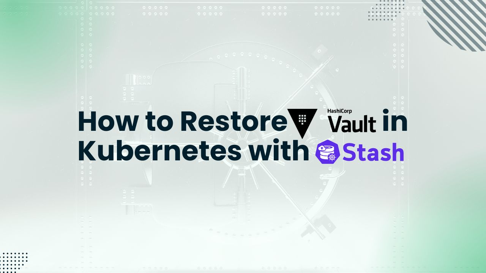

# How to Restore Vault in Kubernetes with Stash



Protecting sensitive information, such as API keys, passwords, and certificates, is essential in today's cloud-native environment. [HashiCorp Vault](https://developer.hashicorp.com/vault) has strong secret management features. Hashicorp's Vault on Kubernetes can be deployed and configured using [KubeVault](https://kubevault.com), a production-grade Kubernetes operator solution. For cloud-native applications, it offers automation, scalability, and security while simplifying secret management. Furthermore, [Stash](https://stash.run/) offers a backup and restore solution for Vault data that is native to Kubernetes, ensuring data durability and disaster recovery.

This article will show you how to restore vault in Kubernetes cluster using Stash and KubeVault. Regardless of your role—security specialist, cloud architect, or DevOps engineer—this comprehensive guide will help you build a robust disaster recovery plan for your Kubernetes secret management system.

Before proceeding with this article, make sure that you have read the article on how to [backup vault in kubernetes](https://kubevault.com/articles/how-to-backup-vault-in-kubernetes-with-stash/). It will show you how to to deploy and take backup of the vault server, which we'll use to restore the vault in this article.

## Install KubeVault and Stash

### Pre-requisites

First, we will set up the environment, and after that we will use KubeVault and Stash to deploy and restore a vault server. You need to have a Kubernetes cluster. You should understand the basics of Kubernetes concepts like cluster, pod, service, and secret. You should also be familiar with [Vault](https://www.vaultproject.io/). Here, our Kubernetes cluster will be created using [Kind](https://kubernetes.io/docs/tasks/tools/#kind). Additionally, [Helm](https://helm.sh/docs/intro/install/) needs to be installed on our Kubernetes cluster.  Basic knowledge of various Kubernetes concepts are required, for example, pod, service, secret, cluster, and also have a basic idea about HashiCorp Vault.

In this article, it is required to install the KubeVault operator in your Kubernetes cluster. A license is required to use KubeVault on a Kubernetes cluster, and it is available for free from the [Appscode License Server](https://appscode.com/issue-license/). The Kubernetes cluster ID is required in order to obtain this license. You can use the command we've included below to find this ID.
 
```bash
$ kubectl get ns kube-system -o jsonpath='{.metadata.uid}'
e5b4a1a0-5a67-4657-b370-db7200108cae
```

After providing the necessary information and hitting the submit button, the license server will email a "license.txt" file. To install KubeVault, run the following commands:

```bash
$ helm install kubevault oci://ghcr.io/appscode-charts/kubevault \
  --version v2025.2.10 \
  --namespace kubevault --create-namespace \
  --set-file global.license=/path/to/the/license.txt \
  --wait --burst-limit=10000 --debug
```

Verify the installation by the following command:

```bash
$ kubectl get pods --all-namespaces -l "app.kubernetes.io/instance=kubevault"
NAMESPACE   NAME                                                  READY   STATUS    RESTARTS   AGE
kubevault   kubevault-kubevault-operator-f89555d55-rwf49          1/1     Running   0          64m
kubevault   kubevault-kubevault-webhook-server-6497bb6d69-4wvpr   1/1     Running   0          64m
``` 

Within a short time all the pods in kubevault namespace will start running. If all pod statuses are running, we can move on to the next phase.

For any confusion regarding KubeVault installation, you can follow the [KubeVault-Setup](https://kubevault.com/docs/latest/setup/) page.


Also, install Stash in your cluster following the steps [here](https://stash.run/docs/v2024.4.8/setup/install/stash/).

### Create a Namespace

After that, we'll create a new namespace in which we will deploy Vault Server. In this case, we have created demo namespace, but you can create namespace with any name that you want. To create the namespace, we can use the following command:

```bash
$ kubectl create namespace demo
namespace/demo created
```

## Restore Vault in Kubernetes

### Prepare Backend

We are going to restore vault data from the GCS bucket where we restored the vault data. We have to create a Secret with necessary credentials and a Repository crd to use this backend. If you want to use a different backend,
please read the respective backend configuration doc from [here](https://stash.run/docs/v2022.12.11/guides/backends/overview/).

#### Create Secret

Let’s create a secret called `gcs-secret` with access credentials to our desired GCS bucket,

```bash
$ echo -n 'restic-pass' > RESTIC_PASSWORD
$ echo -n 'project-id' > GOOGLE_PROJECT_ID
$ cat sa.json > GOOGLE_SERVICE_ACCOUNT_JSON_KEY

$ kubectl create secret generic -n demo gcs-secret \
    --from-file=./RESTIC_PASSWORD \
    --from-file=./GOOGLE_PROJECT_ID \
    --from-file=./GOOGLE_SERVICE_ACCOUNT_JSON_KEY
```

Now, we are ready to restore our workload’s data from our desired backend.

#### Create Repository

Now, create a `Repository` using this secret. Below is the YAML of Repository crd we are going to create,

```yaml
apiVersion: stash.appscode.com/v1alpha1
kind: Repository
metadata:
  name: gcp-demo-repo
  namespace: demo
spec:
  backend:
    gcs:
      bucket: stash-testing
      prefix: demo-vault
    storageSecretName: gcs-secret
  usagePolicy:
    allowedNamespaces:
      from: Same
  wipeOut: false
```

```bash
$ kbuectl apply -f repository.yaml
```

Now, we are ready to restore our sample data from this backend.

### Restore

There are two scenarios. First is you have your vault server running from where you took backup and you want to restore the vault data in the same vault. Another is when you deleted the vault server from where the backup is taken and created another vault server where you want to restore the data. 

#### Restore Snapshot for same Vault

First, we will see how you can restore a snapshot into the same Vault cluster. Vault cluster must be `Initialized` & `Unsealed` before trying to restore the snapshot.

Then, simply you can create a RestoreSession to restore the snapshot.

##### Create RestoreSession

Below is the YAML of the `RestoreSession` crd that we are going to create,

```yaml
apiVersion: stash.appscode.com/v1beta1
kind: RestoreSession
metadata:
  name: vault-restore-session
  namespace: demo
spec:
  repository:
    name: gcp-demo-repo
  target:
    ref:
      apiVersion: appcatalog.appscode.com/v1alpha1
      kind: AppBinding
      name: vault
  runtimeSettings:
    container:
      securityContext:
        runAsUser: 0
        runAsGroup: 0
  rules:
    - snapshots: [latest]
```

Let’s create the `RestoreSession` CR we have shown above,

```bash
$ kubectl apply -f restore-session.yaml
```

Now, wait for RestoreSession to succeed:

```bash
$ kubectl get restoresession -n demo

NAME                    REPOSITORY      PHASE       DURATION   AGE
vault-restore-session   gcp-demo-repo   Succeeded   19s        27s
```

#### Restore Snapshot for different Vault
Follow this guideline if you want to restore a snapshot into a different Vault cluster.

You need to deploy the new `Vault` cluster & it must be `Initialized` & `Unsealed`. 

##### Deploy VaultServer with KubeVault operator

First, we need to create a yaml configuration that will be used to deploy HashiCorp Vault Server on Kubernetes. Many Storage Backend types for Vault Server are supported by KubeVault. Integrated Storage (aka Raft) and Consul are two storage backend types that are recommended.

We will apply the following yaml of vault server which uses raft as the storage backend:

```yaml
apiVersion: kubevault.com/v1alpha2
kind: VaultServer
metadata:
  name: vault
  namespace: demo
spec:
  allowedSecretEngines:
    namespaces:
      from: All
  version: 1.18.4
  replicas: 3
  backend:
    raft:
      storage:
        storageClassName: "standard"
        resources:
          requests:
            storage: 1Gi
  unsealer:
    secretShares: 5
    secretThreshold: 3
    mode:
      kubernetesSecret:
        secretName: vault-keys
  terminationPolicy: WipeOut
```

In this yaml,

- `spec.replicas` specifies the number of Vault nodes to deploy. It has to be a positive number. Note: Amazon EKS does not support HA for Vault. As we using Amazon EKS as our backend it has to be 1.
- `spec.version` specifies the name of the VaultServerVersion CRD. This CRD holds the image name and version of the Vault, Unsealer, and Exporter.
- `spec.allowedSecretEngines` defines the Secret Engine informations which to be granted in this Vault Server.
- `spec.backend` is a required field that contains the Vault backend storage configuration.
- `spec.unsealer` specifies Unsealer configuration. Unsealer handles automatic initializing and unsealing of Vault.
- `spec.terminationPolicy` field is Wipeout means that vault will be deleted without restrictions. It can also be “Halt”, “Delete” and “DoNotTerminate”. Learn More about these [HERE](https://kubevault.com/docs/v2025.2.10/concepts/vault-server-crds/vaultserver/#specterminationpolicy).

We will save this yaml configuration to `vault.yaml`. Then create the above HashiCorp Vault Server object.

```bash
$ kubectl create -f vault.yaml
vaultserver.kubevault.com/vault created
```

This will create a `VaultServer` custom resource. The KubeVault Kubernetes Operator will watch this and create three HashiCorp Vault Server pods in the specified namespace.
If all the above steps are handled correctly and the Vault is deployed, you will see that the following objects are created:

```bash
$ kubectl get all -n demo
NAME          READY   STATUS    RESTARTS   AGE
pod/vault-0   2/2     Running   0          4m7s
pod/vault-1   2/2     Running   0          3m38s
pod/vault-2   2/2     Running   0          3m19s

NAME                                       TYPE          VERSION   AGE
appbinding.appcatalog.appscode.com/vault   VaultServer   1.12.1    4m7s

NAME                              REPLICAS   VERSION   STATUS   AGE
vaultserver.kubevault.com/vault   3          1.12.1    Ready    4m31s

NAME                                                            STATUS    AGE
vaultpolicy.policy.kubevault.com/vault-auth-method-controller   Success   2m55s

NAME                                                                   STATUS    AGE
vaultpolicybinding.policy.kubevault.com/vault-auth-method-controller   Success   2m53s
```

We have successfully deployed Vault in Kubernetes with the Kubernetes KubeVault operator. Now, we will connect to the deployed Vault Server and verify whether it is usable or not. First, check the status,

```bash
$ kubectl get vaultserver -n demo
NAME    REPLICAS   VERSION   STATUS   AGE
vault   3          1.12.1    Ready    5m48s
```

From the output above, we can see that the `VaultServer` is ready to use.

### Accessing Vault Server Through CLI

We will connect to the Vault by using Vault CLI. Therefore, we need to export the necessary environment variables and port-forward the service.

In one terminal port-forward the vault server service,

```bash
kubectl port-forward -n demo service/vault 8200
Forwarding from 127.0.0.1:8200 -> 8200
Forwarding from [::1]:8200 -> 8200
```

We will connect to the HashiCorp Vault Server by using Vault CLI. Therefore, we need to export the necessary environment variables. So, in another terminal export the environment variables and interact with the vault server with Vault CLI,
```bash
$ export VAULT_ADDR=http://127.0.0.1:8200
$ export VAULT_TOKEN=(kubectl vault root-token get vaultserver vault -n demo --value-only)

##Check Vault Status
$ vault status
Key                     Value
---                     -----
Seal Type               shamir
Initialized             true
Sealed                  false
Total Shares            5
Threshold               3
Version                 1.12.1
Build Date              2022-10-27T12:32:05Z
Storage Type            raft
Cluster Name            vault-cluster-b199935d
Cluster ID              5549e2d1-0181-0bfb-752b-59f94dac3325
HA Enabled              true
HA Cluster              https://vault-0.vault-internal:8201
HA Mode                 active
Active Since            2025-03-20T05:35:11.913829478Z
Raft Committed Index    429
Raft Applied Index      429
```


This `Vault` has a completely different set of `unseal keys` & `root token` from the `Vault` from which the snapshot was taken.

`Vault` snapshot carries the signature of `unseal keys`. So, we need to restore the snapshot forcefully & to bypass this, we need to modify our restore `function` accordingly. A `Function` CRD may look like this:

```yaml
apiVersion: stash.appscode.com/v1beta1
kind: Function
metadata:
  name: vault-restore-1.10.3
spec:
  args:
  - restore-vault
  - --provider=${REPOSITORY_PROVIDER:=}
  - --bucket=${REPOSITORY_BUCKET:=}
  - --endpoint=${REPOSITORY_ENDPOINT:=}
  - --region=${REPOSITORY_REGION:=}
  - --path=${REPOSITORY_PREFIX:=}
  - --storage-secret-name=${REPOSITORY_SECRET_NAME:=}
  - --storage-secret-namespace=${REPOSITORY_SECRET_NAMESPACE:=}
  - --scratch-dir=/tmp
  - --enable-cache=${ENABLE_CACHE:=true}
  - --max-connections=${MAX_CONNECTIONS:=0}
  - --wait-timeout=${waitTimeout:=300}
  - --hostname=${HOSTNAME:=}
  - --source-hostname=${SOURCE_HOSTNAME:=}
  - --interim-data-dir=${INTERIM_DATA_DIR}
  - --namespace=${NAMESPACE:=default}
  - --appbinding=${TARGET_NAME:=}
  - --appbinding-namespace=${TARGET_NAMESPACE:=}
  - --snapshot=${RESTORE_SNAPSHOTS:=}
  - --vault-args=${args:=}
  - --output-dir=${outputDir:=}
  - --license-apiservice=${LICENSE_APISERVICE:=}
  - --force=${force:=false}
  - --key-prefix=${keyPrefix:=}
  - --old-key-prefix=${oldKeyPrefix:=}
  image: stashed/stash-vault:1.10.3
```

Let’s take a look at some of the more relevant flags, that we can set to override the existing flags:
```bash
- --force=${force:=false}
- --key-prefix=${keyPrefix:=}
- --old-key-prefix=${oldKeyPrefix:=}
```

By default, the `--force` flag is `false`, so in order to restoring the snapshot into a different Vault cluster, this must be set to true.

Moreover, once the snapshot will be restored, the newly `Vault` will be expecting the older `unseal keys` to unseal itself & the new `unseal keys` will not be required/valid anymore. So, we’ll also migrate the older `unseal keys` & `root token` in place of the new `unseal keys` & `root token`.

Since, `Stash` will also take backup of the Vault `unseal keys` & `root token` along with the snapshot, we can get the older `unseal keys` & `root token`. To correctly get those, we must set the `--old-key-prefix` flag properly.
```yaml
- --force=${force:=true}
- --key-prefix=${keyPrefix:=}
- --old-key-prefix=${oldKeyPrefix:=<old-key-prefix>}
```

`KeyPrefix` will be generated by the following structure by `KubeVault` operator: `k8s.{kubevault.com or cluster UID}.{vault-namespace}.{vault-name}`. In case of Vault deployment using Vault Helm-chart or if you want to save it with a different prefix, you need to override the `KeyPrefix` section.

The default `key-prefix`, associated `Task` for `Backup` & `Restore` can be found in the Vault `AppBinding` YAML:

```yaml
stash:
  addon:
    backupTask:
      name: vault-backup-1.10.3
      params:
      - name: keyPrefix
        value: k8s.kubevault.com.demo.vault
    restoreTask:
      name: vault-restore-1.10.3
      params:
      - name: keyPrefix
        value: k8s.kubevault.com.demo.vault
```

Now, we need to apply the changes in our restore `Function` CRD. Now, we can create the `RestoreSession` to restore the Vault cluster by the similar way mentioned above.


## Conclusion

In conclusion, utilizing KubeVault to integrate HashiCorp Vault with Kubernetes provides a reliable and safe way to manage secrets in a cloud-native environment. The combination of Kubernetes clusters with Vault's strong security features allows private information, such as API keys, passwords, and certificates, to be safely stored and made accessible. With KubeVault, you can streamline secret management, automate deployment, and enable seamless connection with Kubernetes applications.

Including Stash provides a comprehensive Kubernetes-native solution backup and restore vault in Kubernetes, which increases system resilience. Because Stash can provide reliable restorations and provide automated, policy-driven backup schedules, your secrets management infrastructure can recover swiftly from any unforeseen incidents. You may create a complete, safe, and resilient secrets management solution that is suited for contemporary cloud-native apps by fusing Stash's dependable backup and restoration features with KubeVault's strong secret management capabilities.