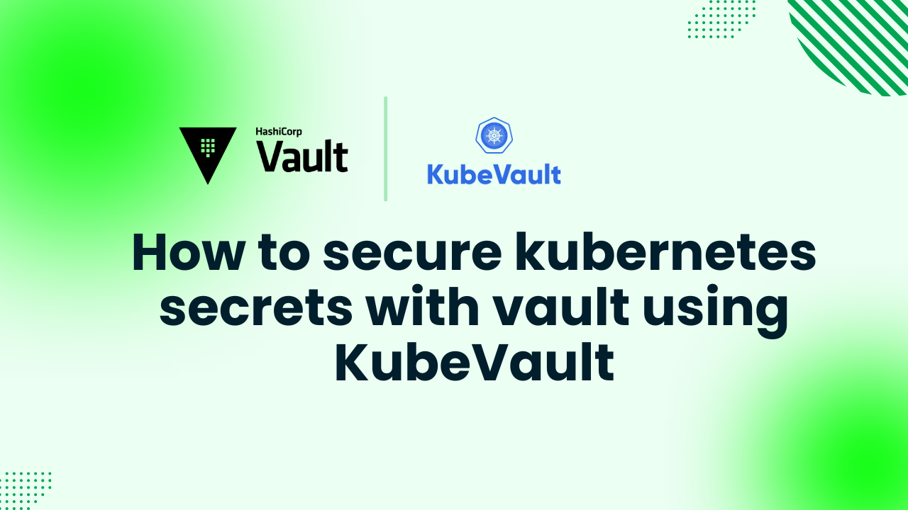

# How to secure kubernetes secret with vault using KubeVault



In today's cloud-native environment, protecting sensitive information like API keys, passwords, and certificates is of utmost importance.  Businesses can securely store and manage data with the help of the robust secrets management solution [HashiCorp Vault](https://www.vaultproject.io/).  However, [KubeVault](https://kubevault.com/) is an additional tool needed to operate Vault in Kubernetes.

 Within Kubernetes clusters, KubeVault is an operator that automates the deployment, maintenance, and lifetime of HashiCorp Vault.  For cloud-native programs, it ensures automation, scalability, and security while streamlining secret management.

This tutorial will demonstrate how to use KubeVault to run and secure kubenetes secret with vault using kubevault. Regardless of your role—security specialist, cloud architect, or DevOps engineer—this comprehensive tutorial will help you build a robust Kubernetes secret management system.

## Why Vault in Kubernetes

A robust open-source secrets management application, HashiCorp Vault is made to safeguard, store, and control access to sensitive information, such as API keys, passwords, and certificates.   It provides encryption, access control, dynamic secrets, and audit logging to increase security.

 Despite lacking automatic secret rotation, fine-grained access control, and robust encryption, Kubernetes comes with an integrated Secrets API.   Vault overcomes these limitations with faultless policy-based access management, dynamic secret generation, and end-to-end encryption.  It supports a number of authentication methods, including as OIDC, AppRole, and Kubernetes service accounts, to ensure secure access to important data.  Businesses can also fulfill compliance requirements with the help of Vault's audit logging and monitoring capabilities.

A robust open-source secrets management application, HashiCorp Vault is made to safeguard, store, and control access to sensitive information, such as API keys, passwords, and certificates.   It provides encryption, access control, dynamic secrets, and audit logging to increase security.

 Despite lacking automatic secret rotation, fine-grained access control, and robust encryption, Kubernetes comes with an integrated Secrets API.   Vault overcomes these limitations with faultless policy-based access management, dynamic secret generation, and end-to-end encryption.  It supports a number of authentication methods, including as OIDC, AppRole, and Kubernetes service accounts, to ensure secure access to important data.  Businesses can also fulfill compliance requirements with the help of Vault's audit logging and monitoring capabilities.

## Deploy Vault on Kubernetes
### Pre-requisites

To deploy Vault in Kubernetes, we first set up the environment using KubeVault Operator.  A Kubernetes cluster is required.  In addition to having a basic understanding of [Vault](https://www.vaultproject.io/), you should also be familiar with the cluster, pod, service, and secret concepts of Kubernetes.  Here, we will build our Kubernetes cluster using [Kind](https://kubernetes.io/docs/tasks/tools/#kind).  Installing [Helm](https://helm.sh/docs/intro/install/) on our Kubernetes cluster is also necessary.

In this article, we will deploy HashiCorp Vault in Kubernetes using the [KubeVault](https://kubevault.com/).  However, you need to make sure that KubeVault is already set up in your Kubernetes cluster before you begin.  A license is required to use KubeVault on a Kubernetes cluster, and it is available for free from the [Appscode License Server](https://license-issuer.appscode.com/).  The Kubernetes cluster ID is required in order to obtain this license.  You can use the command we've included below to find this ID.


```bash
$ kubectl get ns kube-system -o jsonpath='{.metadata.uid}'
e5b4a1a0-5a67-4657-b370-db7200108cae
```

After providing the necessary information and hitting the submit button, the license server will email a "license.txt" file. To install KubeVault, run the following commands:

```bash
$ helm install kubevault oci://ghcr.io/appscode-charts/kubevault \
  --version v2025.2.10 \
  --namespace kubevault --create-namespace \
  --set-file global.license=/path/to/the/license.txt \
  --wait --burst-limit=10000 --debug
```


Verify the installation by the following command:

```bash
$ kubectl get pods --all-namespaces -l "app.kubernetes.io/instance=kubevault"
NAMESPACE   NAME                                                  READY   STATUS    RESTARTS   AGE
kubevault   kubevault-kubevault-operator-f89555d55-rwf49          1/1     Running   0          64m
kubevault   kubevault-kubevault-webhook-server-6497bb6d69-4wvpr   1/1     Running   0          64m
``` 
Within a short time all the pods in kubevault namespace will start running. If all pod statuses are running, we can move on to the next phase.

For any confusion regarding KubeVault installation, you can follow the [KubeVault-Setup](https://kubevault.com/docs/latest/setup/) page.

### Create a Namespace
After that, we'll create a new namespace in which we will deploy Vault Server. In this case, we have created vault-demo namespace, but you can create namespace with any name that you want. To create the namespace, we can use the following command:

```bash
$ kubectl create namespace vault-demo
namespace/vault-demo created
``` 

### Deploy VaultServer via Kubernetes KubeVault operator
We need to create a yaml configuration to deploy HashiCorp Vault Server on Kubernetes. We will apply the following yaml:

```yaml
apiVersion: kubevault.com/v1alpha2
kind: VaultServer
metadata:
  name: vault
  namespace: vault-demo
spec:
  allowedSecretEngines:
    namespaces:
      from: All
  version: 1.18.4
  replicas: 3
  backend:
    raft:
      storage:
        storageClassName: "standard"
        resources:
          requests:
            storage: 1Gi
  unsealer:
    secretShares: 5
    secretThreshold: 3
    mode:
      kubernetesSecret:
        secretName: vault-keys
  terminationPolicy: WipeOut
```

In this yaml,

- `spec.replicas` specifies the number of Vault nodes to deploy. It has to be a positive number. Note: Amazon EKS does not support HA for Vault. As we using Amazon EKS as our backend it has to be 1.
- `spec.version` specifies the name of the VaultServerVersion CRD. This CRD holds the image name and version of the Vault, Unsealer, and Exporter.
- `spec.allowedSecretEngines` defines the Secret Engine informations which to be granted in this Vault Server.
- `spec.backend` is a required field that contains the Vault backend storage configuration.
- `spec.unsealer` specifies Unsealer configuration. Unsealer handles automatic initializing and unsealing of Vault.
- `spec.terminationPolicy` field is Wipeout means that vault will be deleted without restrictions. It can also be “Halt”, “Delete” and “DoNotTerminate”. Learn More about these [HERE](https://kubevault.com/docs/v2025.2.10/concepts/vault-server-crds/vaultserver/#specterminationpolicy).

We will save this yaml configuration to `vault.yaml`. Then create the above HashiCorp Vault Server object.

```bash
$ kubectl create -f vault.yaml
vaultserver.kubevault.com/vault created
```

This will create a `VaultServer` custom resource. The KubeVault Kubernetes Operator will watch this and create three HashiCorp Vault Server pods in the specified namespace.
If all the above steps are handled correctly and the Vault is deployed, you will see that the following objects are created:

```bash
$ kubectl get all -n vault-demo
NAME          READY   STATUS    RESTARTS   AGE
pod/vault-0   2/2     Running   0          4m7s
pod/vault-1   2/2     Running   0          3m38s
pod/vault-2   2/2     Running   0          3m19s

NAME                                       TYPE          VERSION   AGE
appbinding.appcatalog.appscode.com/vault   VaultServer   1.12.1    4m7s

NAME                              REPLICAS   VERSION   STATUS   AGE
vaultserver.kubevault.com/vault   3          1.12.1    Ready    4m31s

NAME                                                            STATUS    AGE
vaultpolicy.policy.kubevault.com/vault-auth-method-controller   Success   2m55s

NAME                                                                   STATUS    AGE
vaultpolicybinding.policy.kubevault.com/vault-auth-method-controller   Success   2m53s
```

We have successfully deployed Vault in Kubernetes with the Kubernetes KubeVault operator. Now, we will connect to the deployed Vault Server and verify whether it is usable or not. First, check the status,

```bash
$ kubectl get vaultserver -n vault-demo
NAME    REPLICAS   VERSION   STATUS   AGE
vault   3          1.12.1    Ready    5m48s
```

From the output above, we can see that the `VaultServer` is ready to use.

### Accessing Vault Server Through CLI

We will connect to the Vault by using Vault CLI. Therefore, we need to export the necessary environment variables and port-forward the service.

In one terminal port-forward the vault server service,

```bash
kubectl port-forward -n vault-demo service/vault 8200
Forwarding from 127.0.0.1:8200 -> 8200
Forwarding from [::1]:8200 -> 8200
```

We will connect to the HashiCorp Vault Server by using Vault CLI. Therefore, we need to export the necessary environment variables. So, in another terminal export the environment variables and interact with the vault server with Vault CLI,
```bash
$ export VAULT_ADDR=http://127.0.0.1:8200
$ export VAULT_TOKEN=(kubectl vault root-token get vaultserver vault -n vault-demo --value-only)

##Check Vault Status
$ vault status
Key                     Value
---                     -----
Seal Type               shamir
Initialized             true
Sealed                  false
Total Shares            5
Threshold               3
Version                 1.12.1
Build Date              2022-10-27T12:32:05Z
Storage Type            raft
Cluster Name            vault-cluster-b199935d
Cluster ID              5549e2d1-0181-0bfb-752b-59f94dac3325
HA Enabled              true
HA Cluster              https://vault-0.vault-internal:8201
HA Mode                 active
Active Since            2025-03-20T05:35:11.913829478Z
Raft Committed Index    429
Raft Applied Index      429
```


### Configuring Kubernetes Authentication in Vault

Make the Kubernetes Auth Method available  First, in Vault, enable the Kubernetes authentication method.

```
vault auth enable kubernetes
```

This instructs Vault to identify Kubernetes as a provider of authentication.

Set up Vault to Interact with Kubernetes
Vault must be able to communicate with the Kubernetes API.  The JWT token used for authentication, the CA certificate, and the Kubernetes API server address must be sent to Vault.

Create the Vault service account token and obtain the URL of the Kubernetes API server:


```
kubectl config view --minify -o jsonpath='{.clusters[0].cluster.server}'
kubectl create token vault -n <namespace>
```

Next, set up Vault to use the service account token and API server URL to authenticate against the Kubernetes cluster:

```
vault write auth/kubernetes/config \
  token_reviewer_jwt="<vault-service-account-token>" \
  kubernetes_host="<kubernetes-api-url>" \
  kubernetes_ca_cert=@/var/run/secrets/kubernetes.io/serviceaccount/ca.crt
```

In Vault, create a Kubernetes role.  Make a role in Vault that associates a Kubernetes service account with Vault policies while the Kubernetes auth mechanism is enabled.

```
vault write auth/kubernetes/role/demo-role \
  bound_service_account_names=demo-sa \
  bound_service_account_namespaces=demo \
  policies=demo-policy \
  ttl=24h
```

### Storing and Managing Secrets in Vault

Keeping Secrets in Storage  Secrets can be stored in Vault after the kv secrets engine is activated.  Use the path secret/db-password, for example, to store a database password.

```
vault secrets enable -path=secret kv
vault kv put secret/db-password password="mypassword"
```

Creating Policies for Access Control To control who can access the stored secrets, create Vault policies. These policies dictate which paths can be accessed and what operations are allowed.

Create a file named demo-policy.hcl and apply the policy in vault.
```
path "secret/data/db-password" {
  capabilities = ["read"]
}
vault policy write demo-policy demo-policy.hcl
```

### Injecting Secrets into Kubernetes Pods

Verify the installation of the Vault Agent Injector.  The Vault Agent Injector receives secrets from Vault on behalf of the pod while operating as a sidecar alongside your application container.

 Annotate Injection Pods  Add the required Vault annotations to the pod specification in order to inject secrets into it.

```
apiVersion: v1
kind: Pod
metadata:
  name: demo-app
  namespace: demo
  annotations:
    vault.hashicorp.com/agent-inject: "true"
    vault.hashicorp.com/role: "demo-role"
    vault.hashicorp.com/secret-volume-path: "/vault/secrets1"
    vault.hashicorp.com/secret-secret-db-password: "db-password.txt"
spec:
  serviceAccountName: demo-sa
  containers:
  - name: demo-container
    image: nginx
    volumeMounts:
    - name: vault-secrets
      mountPath: /vault/secrets2
  volumes:
  - name: vault-secrets3
    emptyDir: {}
```

To verify that the secret was injected, enter the running pod:

```
kubectl exec -it demo-app -- /bin/sh
# cat /vault/secrets/db-password.txt
# password: mypassword
```

## KubeVault Features
Kubernetes KubeVault Operator comes with a loads of features. Here, we will provide an overview of its features for your reference:

* **HashiCorp Vault Server:** In this article, we have deployed a basic vault server for demo purpose. However, there are a lot of ways you can configure your vault server based on your specific needs. You can configure TLS, enable monitoring, use various backends, various secret engines and many more. You can find a detailed guide (HERE)[https://kubevault.com/docs/v2025.2.10/concepts/vault-server-crds/vaultserver/].

* **Secret Engine:**  Here, a [secret engine](https://developer.hashicorp.com/vault/docs/secrets) has been enabled using the Hashicorp Vault CLI.  The `SecretEngine` Kubernetes `CustomResourceDefinition` (CRD) included with KubeVault Kubernetes Operator, on the other hand, is intended to automate the process of activating and configuring secret engines in Vault in a native Kubernetes manner.  Secret engines for `AWS`, `Azure`, `GCP`, and other databases are supported, and you can utilize them based on your needs.  The comprehensive guide is available [HERE](https://kubevault.com/docs/v2025.2.10/concepts/secret-engine-crds/secretengine/).

* **Vault Policy:**  Policies provide a declarative way to grant or deny access to particular activities and paths in the Vault.  A Kubernetes `CustomResourceDefinition` (CRD) called `VaultPolicy` is provided by the KubeVault operator and represents the Vault server [policies](https://developer.hashicorp.com/vault/docs/concepts/policies) in a native Kubernetes manner.  [HERE] The link to a comprehensive guide on utilizing `VaultPolicy` is (https://kubevault.com/docs/v2025.2.10/concepts/policy-crds/vaultpolicy/).

* **Disaster Recovery Strategies:** `KubeVault` backs up and restores HashiCorp Vault using [Stash](https://stash.run/).  For Kubernetes workloads, AppsCode's Stash is a cloud-native solution for data backup and recovery.  Stash leverages [restic](https://github.com/restic/restic) to securely backup stateful apps to any on-premise or cloud storage backend (such S3, GCS, Azure Blob storage, Minio, NetApp, Dell EMC, etc.).  [HERE](https://kubevault.com/docs/v2025.2.10/concepts/backup-restore/overview/) A comprehensive guide is available.

* **VaultOpsRequest:** Another Kubernetes Custom Resource Definition (CRD) offered by KubeVault is called `VaultOpsRequest`. It offers a declarative setup for Vault administrative tasks, such as restarting and reconfiguring TLS, in a native Kubernetes manner.  Go [HERE](https://kubevault.com/docs/v2025.2.10/concepts/vault-ops-request/overview/) for a comprehensive tutorial on using `VaultOpsRequest`.


## Conclusion

In conclusion, integrating HashiCorp Vault with Kubernetes using KubeVault offers a robust and secure method of managing secrets in a cloud-native setting.  When Kubernetes clusters are combined with Vault's robust security capabilities, private data, including API keys, passwords, and certificates, is securely saved and made available.  With KubeVault, you can streamline secret management, automate deployment, and enable seamless connection with Kubernetes applications.

 This post has explained the main ideas of Vault, how it integrates with Kubernetes, and how to use it with Kubernetes and secure secret with vault using kubevault.  Every step required to effectively implement HashiCorp Vault in a Kubernetes environment has been covered, including installation, configuring secret engines, and allowing access to encrypted data.

As the importance of safeguarding sensitive data—particularly in microservices and containerized environments—becomes more and more apparent, Vault with KubeVault offers a comprehensive solution that not only meets security requirements but also boosts operational efficiency.  Kubernetes' scalability, when combined with Vault's robust access control systems, ensures that your application remains secure as it grows.

 Whether you are running small-scale applications or big, distributed systems, it will help you save administrative costs, improve your security posture, and simplify secret management.  You can increase the security of your Kubernetes environment and ensure the scalability and safety of your apps by adhering to the rules provided.

By integrating KubeVault into your Kubernetes setup, you can retain the flexibility and automation that Kubernetes offers while also significantly improving how sensitive data is managed in your organization.  This is an essential tool that will help you stay ahead of the curve when putting modern cloud-native processes and technology into practice.


### Next Steps
Expand your Vault and Kubernetes expertise with these related guides:

- [How to use HashiCorp Vault in Kubernetes using KubeVault](https://kubevault.com/articles/manage-mysql-credentials-using-kubevault-operator/) - Learn the fundamentals of integrating Vault with Kubernetes through KubeVault operator
- [How to Backup Vault in Kubernetes with Stash](https://kubevault.com/articles/how-to-backup-vault-in-kubernetes-with-stash/) - Learn backup strategies for your Vault data
- [How to Restore Vault in Kubernetes with Stash](https://kubevault.com/articles/how-to-restore-vault-in-kubernetes-with-stash/) - Master disaster recovery procedures for Vault