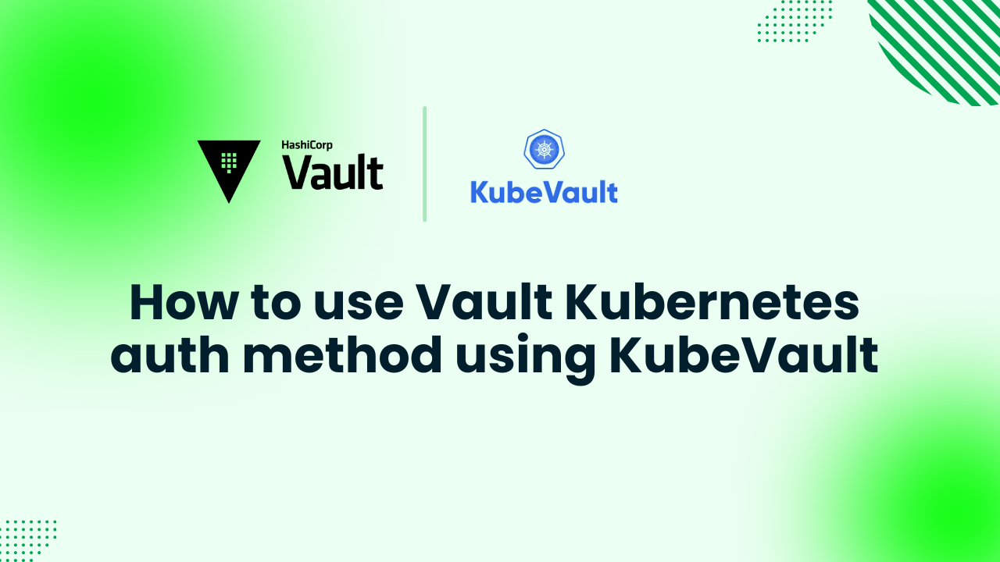

# How to use Vault Kubernetes auth method using KubeVault



Protecting sensitive data—such as API keys, passwords, and certificates—is a top priority in today’s cloud-native landscape. [HashiCorp Vault](https://www.vaultproject.io/) is a powerful secrets management tool that helps organizations securely store and control access to this critical information. However, running Vault effectively within Kubernetes often requires an additional layer of automation provided by [KubeVault](https://kubevault.com/), including Kubernetes Auth Configuration in Vault to securely integrate Kubernetes service accounts with Vault.

KubeVault is a Kubernetes operator that simplifies the deployment, management, and lifecycle of HashiCorp Vault within Kubernetes clusters. It ensures enhanced security, scalability, and automation for cloud-native applications while streamlining secret management.

In this guide, we’ll walk through how to deploy and manage HashiCorp Vault in a Kubernetes cluster. Whether you’re a security engineer, cloud architect, or DevOps professional, this step-by-step guide will help you build a robust and secure secrets management system for your Kubernetes environment.
## Why Vault in Kubernetes

[HashiCorp Vault](https://www.vaultproject.io/) is a powerful open-source secrets management tool designed to securely store, protect, and manage access to sensitive data such as API keys, passwords, and certificates. It enhances security through features like **audit logging**, **dynamic secrets**, **fine-grained access control**, and **encryption**.

While Kubernetes includes a built-in Secrets API, it lacks several critical security features—such as strong encryption, granular access control, and automatic secret rotation. Vault overcomes these limitations with **end-to-end encryption**, **dynamic secret generation**, and **policy-based access management**, including Kubernetes Auth Configuration in Vault to securely authenticate Kubernetes workloads. It also supports multiple authentication mechanisms, including **Kubernetes Service Accounts**, **AppRole**, and **OIDC**, ensuring safe and flexible access to sensitive data. Additionally, Vault’s audit logging and monitoring capabilities help organizations meet compliance and governance requirements.

Running Vault within Kubernetes allows teams to secure their applications without complex manual configurations. Using the Vault Agent Injector, Vault integrates directly with Kubernetes workloads—enabling applications to retrieve secrets dynamically, without modifying their code. This approach enhances **security**, **automation**, and **scalability** while reducing operational overhead.

By running HashiCorp Vault in Kubernetes, organizations gain automated secret rotation, simplified management, and stronger security—ensuring a seamless and secure workflow for cloud-native applications.


## Deploy Vault on Kubernetes
### Pre-requisites
Before deploying HashiCorp Vault in Kubernetes using the KubeVault Operator, we need to prepare the environment. You must have access to a running **Kubernetes cluster** and possess a basic understanding of core Kubernetes concepts such as **clusters**, **pods**, **services**, and **secrets**. Additionally, a foundational knowledge of [Vault](https://www.vaultproject.io/) will be helpful.

In this guide, we’ll use [Kind](https://kubernetes.io/docs/tasks/tools/#kind) (Kubernetes in Docker) to create our Kubernetes cluster. We’ll also install [Helm](https://helm.sh/docs/intro/install/), which is required for managing and deploying applications on the cluster.

We will use [KubeVault](https://kubevault.com/) to deploy **HashiCorp Vault** within the Kubernetes environment.  
Before starting, make sure KubeVault is already installed in your cluster.

It requires a valid license to run. You can obtain a **free license** from the [AppsCode License Server](https://license-issuer.appscode.com/). To generate this license, you’ll need your **Kubernetes Cluster ID**. You can retrieve it by running the following command:

```bash
$ kubectl get ns kube-system -o jsonpath='{.metadata.uid}'
e5b4a1a0-5a67-4657-b370-db7200108cae
```

After providing the necessary information and hitting the submit button, the license server will email a "license.txt" file. To install KubeVault, run the following commands:

```bash
$ helm install kubevault oci://ghcr.io/appscode-charts/kubevault \
  --version v2025.2.10 \
  --namespace kubevault --create-namespace \
  --set-file global.license=/path/to/the/license.txt \
  --wait --burst-limit=10000 --debug
```


Verify the installation by the following command:

```bash
$ kubectl get pods --all-namespaces -l "app.kubernetes.io/instance=kubevault"
NAMESPACE   NAME                                                  READY   STATUS    RESTARTS   AGE
kubevault   kubevault-kubevault-operator-f89555d55-rwf49          1/1     Running   0          64m
kubevault   kubevault-kubevault-webhook-server-6497bb6d69-4wvpr   1/1     Running   0          64m
``` 
Within a short time all the pods in kubevault namespace will start running. If all pod statuses are running, we can move on to the next phase.

For any confusion regarding KubeVault installation, you can follow the [KubeVault-Setup](https://kubevault.com/docs/latest/setup/) page.

### Create a Namespace
After that, we'll create a new namespace in which we will deploy Vault Server. In this case, we have created vault-demo namespace, but you can create namespace with any name that you want. To create the namespace, we can use the following command:

```bash
$ kubectl create namespace vault-demo
namespace/vault-demo created
``` 

### Deploy VaultServer via Kubernetes KubeVault operator
We need to create a yaml configuration to deploy HashiCorp Vault Server on Kubernetes. We will apply the following yaml:

```yaml
apiVersion: kubevault.com/v1alpha2
kind: VaultServer
metadata:
  name: vault
  namespace: vault-demo
spec:
  allowedSecretEngines:
    namespaces:
      from: All
  version: 1.18.4
  replicas: 3
  backend:
    raft:
      storage:
        storageClassName: "standard"
        resources:
          requests:
            storage: 1Gi
  unsealer:
    secretShares: 5
    secretThreshold: 3
    mode:
      kubernetesSecret:
        secretName: vault-keys
  terminationPolicy: WipeOut
```

In this yaml,

- `spec.replicas` specifies the number of Vault nodes to deploy. It has to be a positive number. Note: Amazon EKS does not support HA for Vault. As we using Amazon EKS as our backend it has to be 1.
- `spec.version` specifies the name of the VaultServerVersion CRD. This CRD holds the image name and version of the Vault, Unsealer, and Exporter.
- `spec.allowedSecretEngines` defines the Secret Engine informations which to be granted in this Vault Server.
- `spec.backend` is a required field that contains the Vault backend storage configuration.
- `spec.unsealer` specifies Unsealer configuration. Unsealer handles automatic initializing and unsealing of Vault.
- `spec.terminationPolicy` field is Wipeout means that vault will be deleted without restrictions. It can also be “Halt”, “Delete” and “DoNotTerminate”. Learn More about these [HERE](https://kubevault.com/docs/v2025.2.10/concepts/vault-server-crds/vaultserver/#specterminationpolicy).

We will save this yaml configuration to `vault.yaml`. Then create the above HashiCorp Vault Server object.

```bash
$ kubectl create -f vault.yaml
vaultserver.kubevault.com/vault created
```

This will create a `VaultServer` custom resource. The Operator will watch this and create three HashiCorp Vault Server pods in the specified namespace.
If all the above steps are handled correctly and the Vault is deployed, you will see that the following objects are created:

```bash
$ kubectl get all -n vault-demo
NAME          READY   STATUS    RESTARTS   AGE
pod/vault-0   2/2     Running   0          4m7s
pod/vault-1   2/2     Running   0          3m38s
pod/vault-2   2/2     Running   0          3m19s

NAME                                       TYPE          VERSION   AGE
appbinding.appcatalog.appscode.com/vault   VaultServer   1.12.1    4m7s

NAME                              REPLICAS   VERSION   STATUS   AGE
vaultserver.kubevault.com/vault   3          1.12.1    Ready    4m31s

NAME                                                            STATUS    AGE
vaultpolicy.policy.kubevault.com/vault-auth-method-controller   Success   2m55s

NAME                                                                   STATUS    AGE
vaultpolicybinding.policy.kubevault.com/vault-auth-method-controller   Success   2m53s
```

We have successfully deployed Vault in Kubernetes with the Kubernetes KubeVault operator. Now, we will connect to the deployed Vault Server and verify whether it is usable or not. First, check the status,

```bash
$ kubectl get vaultserver -n vault-demo
NAME    REPLICAS   VERSION   STATUS   AGE
vault   3          1.12.1    Ready    5m48s
```

From the output above, we can see that the `VaultServer` is ready to use.

### Accessing Vault Server Through CLI

We will connect to the Vault by using Vault CLI. Therefore, we need to export the necessary environment variables and port-forward the service.

In one terminal port-forward the vault server service,

```bash
kubectl port-forward -n vault-demo service/vault 8200
Forwarding from 127.0.0.1:8200 -> 8200
Forwarding from [::1]:8200 -> 8200
```

We will connect to the HashiCorp Vault Server by using Vault CLI. Therefore, we need to export the necessary environment variables. So, in another terminal export the environment variables and interact with the vault server with Vault CLI,
```bash
$ export VAULT_ADDR=http://127.0.0.1:8200
$ export VAULT_TOKEN=(kubectl vault root-token get vaultserver vault -n vault-demo --value-only)

##Check Vault Status
$ vault status
Key                     Value
---                     -----
Seal Type               shamir
Initialized             true
Sealed                  false
Total Shares            5
Threshold               3
Version                 1.12.1
Build Date              2022-10-27T12:32:05Z
Storage Type            raft
Cluster Name            vault-cluster-b199935d
Cluster ID              5549e2d1-0181-0bfb-752b-59f94dac3325
HA Enabled              true
HA Cluster              https://vault-0.vault-internal:8201
HA Mode                 active
Active Since            2025-03-20T05:35:11.913829478Z
Raft Committed Index    429
Raft Applied Index      429
```

## Kubernetes Auth Configuration in Vault

### Obtain the CA Certificate of the Kubernetes Cluster

```
kubectl config view --raw --minify --flatten -o jsonpath='{.clusters[].cluster.certificate-authority-data}' | base64 --decode > ca.crt && echo ca.crt
```

### Create a token Secret for the vault Service account

```
cat <<EOF | kubectl apply -f -
apiVersion: v1
kind: Secret
type: kubernetes.io/service-account-token
metadata:
  name: vault-sa-token
  namespace: demo
  annotations:
    kubernetes.io/service-account.name: "vault"
EOF
```

In the same terminal, let's go ahead to enable and configure the Kubernetes authentication method
```bash
$ vault auth enable kubernetes
Success! Enabled kubernetes auth method at: kubernetes/

 vault write auth/kubernetes/config \
             token_reviewer_jwt="$(kubectl get secret vault-sa-token -n demo -o jsonpath='{.data.token}' | base64 --decode)" \
             kubernetes_host="$(kubectl config view --raw --minify --flatten -o jsonpath='{.clusters[].cluster.server}')" \
             kubernetes_ca_cert=@ca.crt
      
Success! Data written to: auth/kubernetes/config
```
Create a test secret in Vault
```
vault secrets enable -path=dev kv
vault kv put dev/test username=myuser password=mypassword
vault kv get dev/test
```
### Application Service Account and Policies

```
cat <<EOF | kubectl apply -f -
apiVersion: v1
kind: ServiceAccount
metadata:
  name: myapp-sa
  namespace: myapp
EOF

cat > myapp-policy.hcl <<EOF
path "dev/data/test" { 
  capabilities = ["list", "read"]
}
EOF

vault policy write myapp-policy myapp-policy.hcl
Success! Uploaded policy: myapp-policy
```

### Creating a Role in Vault

```
vault policy write myapp-policy myapp-policy.hcl
Success! Uploaded policy: myapp-policy
rudro25@Rudro-Office:~$ vault write auth/kubernetes/role/myapp-role \
  bound_service_account_names=myapp-sa \
  bound_service_account_namespaces=myapp \
  policies=myapp-policy \
ttl=924h
Success! Data written to: auth/kubernetes/role/myapp-role
```

### Deploying the Application with Injected Secrets
```
cat <<EOF | kubectl apply -f -
apiVersion: apps/v1
kind: Deployment
metadata:
  name: myapp
  namespace: demo
spec:
  replicas: 1
  selector:
    matchLabels:
      app: myapp
  template:
    metadata:
      labels:
        app: myapp
      annotations:
        vault.security.banzaicloud.io/vault-addr: http://127.0.0.1:8200
        vault.security.banzaicloud.io/vault-auth-method: kubernetes
        vault.security.banzaicloud.io/vault-path: dev
        vault.security.banzaicloud.io/vault-role: myapp-role
        vault.security.banzaicloud.io/vault-skip-verify: 'true'
    spec:
      serviceAccountName: myapp-sa
      containers:
      - name: myapp
        image: busybox:1.33
        command: ["sh", "-c", "echo username is \$TEST_USERNAME && echo password is \$TEST_PASSWORD && sleep 100"]
        env:
EOF       value: vault:dev/data/test#password
deployment.apps/myapp created
```
```
kubectl exec -it -n demo deployment/myapp -- env | grep TEST_
TEST_USERNAME=vault:dev/data/test#username
TEST_PASSWORD=vault:dev/data/test#password
```

These output lines show the environment variables injected into the application pod by the Vault injector. They confirm the Kubernetes auth flow (service account → Vault role) succeeded and the pod was able to read the secrets from the KV path `dev/data/test`. This demonstrates a successful Vault authentication and secret injection into the workload.


## KubeVault Features

The Operator for Kubernetes provides a rich set of features to simplify the deployment, management, and operation of HashiCorp Vault, including Kubernetes Auth Configuration in Vault, which enables secure integration between Vault and Kubernetes workloads. Here’s an overview of its main capabilities:

* **HashiCorp Vault Server:**  
  In this guide, we deployed a basic [Vault server](https://kubevault.com/docs/v2025.2.10/concepts/vault-server-crds/vaultserver/) for demonstration purposes. Vault can be configured in many ways to meet your specific requirements, including enabling TLS, setting up monitoring, using different storage backends, and enabling various secret engines.

* **Secret Engine:**  
  While you can use the HashiCorp Vault CLI to enable secret engines, the Operator provides a Kubernetes `CustomResourceDefinition` (CRD) called **[SecretEngine](https://kubevault.com/docs/v2025.2.10/concepts/secret-engine-crds/secretengine/)** to automate the enabling and configuration of secret engines in a **Kubernetes-native way**. It supports secret engines for `AWS`, `Azure`, `GCP`, and various databases depending on your needs.

* **Vault Policy:**  
  Vault policies provide a declarative way to allow or deny access to specific Vault paths and operations. KubeVault exposes a `VaultPolicy` CRD to represent **[Vault policies](https://kubevault.com/docs/v2025.2.10/concepts/policy-crds/vaultpolicy/)** in a Kubernetes-native manner.

* **Disaster Recovery Strategies:**  
  KubeVault integrates with **[Stash](https://stash.run/)** to handle backup and restore operations for HashiCorp Vault. Stash uses **[restic](https://github.com/restic/restic)** to safely store backups in cloud or on-prem storage backends such as **S3, GCS, Azure Blob, Minio, NetApp, Dell EMC**, etc.

* **VaultOpsRequest:**  
  KubeVault provides a `VaultOpsRequest` CRD for declaratively performing Vault administrative operations, such as **restart**, **TLS reconfiguration**, and other operational tasks in a Kubernetes-native way. More on this can be found in the **[VaultOpsRequest documentation](https://kubevault.com/docs/v2025.2.10/concepts/vault-ops-request/overview/)**.


## Conclusion

Using KubeVault to integrate HashiCorp Vault with Kubernetes provides a robust and secure approach to managing secrets in cloud-native environments. By combining Vault's advanced security features with Kubernetes clusters, sensitive information such as API keys, passwords, and certificates can be safely stored and accessed. It simplifies secret management, automates deployment, and enables seamless integration with Kubernetes applications, including Kubernetes Auth Configuration in Vault for secure service account-based access.

This guide has covered the core concepts of Vault, its integration with Kubernetes, and the steps to run Vault within a Kubernetes cluster. From installation to configuring secret engines and granting access to sensitive data, all necessary steps for deploying HashiCorp Vault successfully in Kubernetes have been addressed.

By leveraging Vault with it, organizations gain a comprehensive solution that not only meets strict security requirements but also enhances operational efficiency. With Vault’s strong access controls and Kubernetes’ scalability, applications remain secure as they grow, whether in microservices or containerized environments.

Implementing these guidelines helps streamline secret management, improve security posture, and reduce administrative overhead, regardless of whether you are managing large distributed systems or smaller-scale applications. Incorporating KubeVault into your Kubernetes setup ensures that sensitive data is handled securely while taking full advantage of Kubernetes’ automation and flexibility.

Overall, It is an essential tool for modern cloud-native workflows, enabling organizations to safeguard sensitive information, maintain scalable infrastructure, and stay ahead in adopting secure, automated Kubernetes practices.