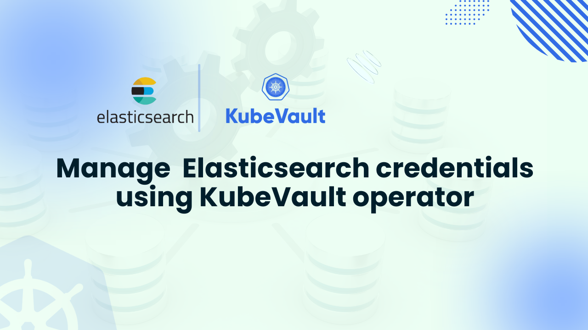

# Manage Elasticsearch credentials using KubeVault operator



Organizations may handle Elasticsearch credentials in a safe, automated, and Kubernetes-native manner by integrating KubeVault with the dynamic secrets engine of HashiCorp Vault.  Based on restrictions and access requirements, Vault manage Elasticsearch credentials using KubeVault on demand rather than managing static usernames and passwords by hand.  These credentials are safely injected into Kubernetes Secrets, rotate automatically, and have a brief lifespan, guaranteeing that apps always have the necessary access without disclosing long-term sensitive data.

Teams can minimize operational risks related to manually rotated or hardcoded Elasticsearch credentials by utilizing this method.  By enforcing time-to-live (TTL) settings for every credential, Vault reduces security vulnerabilities by immediately rescinding compromised or expired credentials.  Developers and operators can benefit from dynamic secret lifetime management without having to change how their apps use credentials thanks to KubeVault's handling of the integration inside Kubernetes.

This approach lessens the workload for database managers and DevOps while greatly enhancing security posture for production-grade Elasticsearch clusters.  Least-privilege access controls, automatic rotation, and revocation all aid in guaranteeing adherence to company security guidelines.  By providing these features directly within the Kubernetes ecosystem, KubeVault expedites the process while facilitating the scaling of Elasticsearch deployments and preserving uniform and auditable secret management procedures across environments.

Centralized governance and auditability for Elasticsearch access are also made possible by KubeVault's interface with Vault.  Vault tracks each credential request, lease, and revocation, giving teams complete insight into who accessed what and when.  In addition to making compliance reporting easier, this aids security teams in promptly identifying and addressing anomalous access patterns.  Organizations may ensure uniform security procedures at scale by standardizing secret management with Vault and integrating Elasticsearch access policies with those utilized across other databases and services.

## Why Use KubeVault for Elasticsearch Secrets Management

HashiCorp Vault is integrated directly into Kubernetes via KubeVault, allowing for a contemporary, automated method of handling Elasticsearch secrets.  It replaces static credentials stored as plain Kubernetes Secrets with dynamic, short-lived Elasticsearch credentials that are produced and cycled automatically by Vault.  The risk of credential breaches or misuse is greatly decreased by this strategy since passwords are temporary and no longer need to be managed manually or included in configuration files or container images.

KubeVault automatically issues, rotates, and revokes credentials on demand to improve Elasticsearch security without requiring downtime or human interaction. Manage Elasticsearch credentials using KubeVault makes guarantee that credentials are always up to date, even while applications still use them as regular Kubernetes Secrets.  Vault policies enforce least-privilege access for developers, CI/CD pipelines, and services by regulating who is allowed to request which credentials.  By doing this, human error is removed, rotation operations are made simpler, and credentials are kept safe and valid for the duration of their lifecycle.

Furthermore, for production-grade Elasticsearch deployments, KubeVault improves auditability and compliance.  Every secret request, credential issuance, rotation, and revocation is meticulously documented by Vault, giving teams complete visibility and traceability.  This allows companies to keep a strong security posture while yet meeting regulatory standards.  KubeVault lowers operational overhead by automating secret management, freeing your teams to concentrate on delivering features rather than manually handling confidential credentials.

## Deploy Vault on Kubernetes
### Pre-requisites

The drawbacks of Kubernetes' native Secrets are addressed by HashiCorp Vault, which provides a dependable way to handle sensitive data, including passwords, database access, and API keys. Manage Elasticsearch credentials using KubeVault, provides enterprise-grade security with encryption, fine-grained access control, dynamic credential generation, and automated rotation, in contrast to standard Kubernetes Secrets.    It offers comprehensive audit logs, a variety of authentication options, and a smooth integration with Kubernetes to satisfy compliance standards.

Using [KubeVault](https://kubevault.com/) operator to manage Elasticsearch credentials is a prerequisite for deploying Vault in Kubernetes.

Prerequisites:

- Knowledge of [Vault](https://developer.hashicorp.com/vault) and Kubernetes themes, including secrets, services, pods, and clusters.

- This tutorial makes use of [Kind](https://kubernetes.io/docs/tasks/tools/#kind) on an operational Kubernetes cluster.

- Your machine has [Helm](https://helm.sh/docs/intro/install/) installed.

After fulfilling these prerequisites, HashiCorp Vault can be deployed in Kubernetes using KubeVault.   Start by making sure KubeVault is already set up in your cluster.   Through the [AppsCode License Server](https://license-issuer.appscode.com/), you can obtain a free license by providing your cluster ID.   The cluster ID can be obtained by using the following command:

```bash
$ kubectl get ns kube-system -o jsonpath='{.metadata.uid}'
e5b4a1a0-5a67-4657-b370-db7200108cae
```

A "license.txt" file will be emailed by the license server once the required data has been entered and the submit button has been clicked.  KubeVault may be installed by using the following commands:

```bash
$ helm install kubevault oci://ghcr.io/appscode-charts/kubevault \
  --version v2025.2.10 \
  --namespace kubevault --create-namespace \
  --set-file global.license=/path/to/the/license.txt \
  --wait --burst-limit=10000 --debug
```


Verify the installation by the following command:

```bash
$ kubectl get pods --all-namespaces -l "app.kubernetes.io/instance=kubevault"
NAMESPACE   NAME                                                  READY   STATUS    RESTARTS   AGE
kubevault   kubevault-kubevault-operator-f89555d55-rwf49          1/1     Running   0          64m
kubevault   kubevault-kubevault-webhook-server-6497bb6d69-4wvpr   1/1     Running   0          64m
``` 
Within a short time all the pods in kubevault namespace will start running. If all pod statuses are running, we can move on to the next phase.

For any confusion regarding KubeVault installation, you can follow the [KubeVault-Setup](https://kubevault.com/docs/latest/setup/) page.

### Create a Namespace
After that, we'll create a new namespace in which we will deploy Vault Server. In this case, we have created vault-demo namespace, but you can create namespace with any name that you want. To create the namespace, we can use the following command:

```bash
$ kubectl create namespace demo
namespace/demo created
``` 

### Deploy VaultServer via Kubernetes KubeVault operator
We need to create a yaml configuration to deploy HashiCorp Vault Server on Kubernetes. We will apply the following yaml:

```yaml
apiVersion: kubevault.com/v1alpha2
kind: VaultServer
metadata:
  name: vault
  namespace: demo
spec:
  allowedSecretEngines:
    namespaces:
      from: All
  version: 1.18.4
  replicas: 3
  backend:
    raft:
      storage:
        storageClassName: "standard"
        resources:
          requests:
            storage: 1Gi
  unsealer:
    secretShares: 5
    secretThreshold: 3
    mode:
      kubernetesSecret:
        secretName: vault-keys
  terminationPolicy: WipeOut
```

In this yaml,

- `spec.replicas` specifies the number of Vault nodes to deploy. It has to be a positive number. Note: Amazon EKS does not support HA for Vault. As we using Amazon EKS as our backend it has to be 1.
- `spec.version` specifies the name of the VaultServerVersion CRD. This CRD holds the image name and version of the Vault, Unsealer, and Exporter.
- `spec.allowedSecretEngines` defines the Secret Engine informations which to be granted in this Vault Server.
- `spec.backend` is a required field that contains the Vault backend storage configuration.
- `spec.unsealer` specifies Unsealer configuration. Unsealer handles automatic initializing and unsealing of Vault.
- `spec.terminationPolicy` field is Wipeout means that vault will be deleted without restrictions. It can also be “Halt”, “Delete” and “DoNotTerminate”. [Follow this guide to learn more about KubeVault's termination policy](https://kubevault.com/docs/v2025.2.10/concepts/vault-server-crds/vaultserver/#specterminationpolicy).

We will save this yaml configuration to `vault.yaml`. Then create the above HashiCorp Vault Server object.

```bash
$ kubectl apply -f vault.yaml
vaultserver.kubevault.com/vault created
```

This will create a `VaultServer` custom resource. The KubeVault Kubernetes Operator will watch this and create three HashiCorp Vault Server pods in the specified namespace.
If all the above steps are handled correctly and the Vault is deployed, you will see that the following objects are created:

```bash
$ kubectl get pod,vaultserver -n demo
NAME                     READY   STATUS    RESTARTS   AGE
pod/vault-0              2/2     Running   0          7m5s
pod/vault-1              2/2     Running   0          6m39s
pod/vault-2              2/2     Running   0          6m15s

NAME                              REPLICAS   VERSION   STATUS   AGE
vaultserver.kubevault.com/vault   3          1.18.4    Ready    7m29s
```

We have successfully deployed Vault in Kubernetes with the Kubernetes KubeVault operator. Now, we will connect to the deployed Vault Server and verify whether it is usable or not. First, check the status,

```bash
$ kubectl get vaultserver -n demo
NAME    REPLICAS   VERSION   STATUS   AGE
vault   3          1.12.1    Ready    5m48s
```

From the output above, we can see that the `VaultServer` is ready to use.

## Install KubeDB on Kubernetes

To set up KubeDB in our Kubernetes cluster, we need a license. Through the Appscode License Server, we can get a free enterprise license. We must provide our Kubernetes cluster ID to obtain a license. Run the following command below to get the cluster ID.

```bash
$ kubectl get ns kube-system -o jsonpath='{.metadata.uid}'
e5b4a1a0-5a67-4657-b370-db7200108cae
```

The license server will email us with a “license.txt” file attached after we provide the necessary data. Run the following commands listed below to install KubeDB.

```bash
$ helm install kubedb oci://ghcr.io/appscode-charts/kubedb \
  --version v2025.4.30 \
  --namespace kubedb --create-namespace \
  --set-file global.license=/path/to/the/license.txt \
  --wait --burst-limit=10000 --debug
```

Verify the installation by the following command,

```bash
kubectl get pods --all-namespaces -l "app.kubernetes.io/instance=kubedb"
NAMESPACE   NAME                                           READY   STATUS    RESTARTS   AGE
kubedb      kubedb-kubedb-autoscaler-0                     1/1     Running   0          6m3s
kubedb      kubedb-kubedb-ops-manager-0                    1/1     Running   0          6m3s
kubedb      kubedb-kubedb-provisioner-0                    1/1     Running   0          6m3s
kubedb      kubedb-kubedb-webhook-server-fb76b7889-qf4ng   1/1     Running   0          6m3s
kubedb      kubedb-petset-5dbd674f4b-hnmwj                 1/1     Running   0          6m3s
kubedb      kubedb-sidekick-6756758dd6-zl5w5               1/1     Running   0          6m3s

```

## Create a Elasticsearch database

We need to create a yaml manifest to install Elasticsearch on Kubernetes. And we will apply this yaml below,

```bash
apiVersion: kubedb.com/v1
kind: Elasticsearch
metadata:
  name: elasticsearch-quickstart
  namespace: demo
spec:
  deletionPolicy: Delete
  storage:
    accessModes:
    - ReadWriteOnce
    resources:
      requests:
        storage: 1Gi
    storageClassName: standard
  storageType: Durable
  version: xpack-8.11.1
```

We will save this yaml configuration to elasticsearch.yaml. Then create the above Elasticsearch object.

```bash
$ kubectl apply -f elasticsearch.yaml
elasticsearch.kubedb.com/elasticsearch-quickstart created
```

If all the above steps are handled correctly and the Elasticsearch is deployed, you will see that the following objects are created:

```bash
$ kubectl get pod,elasticsearch -n demo
NAME                                READY   STATUS    RESTARTS   AGE
pod/elasticsearch-quickstart-0      1/1     Running   0          2m59s


NAME                                                    VERSION   STATUS   AGE
elasticsearch.kubedb.com/elasticsearch-quickstart       6.2.14    Ready    3m2s

```

## Manage Elasticsearch credentials using KubeVault

### Enable and Configure Elasticsearch Secret Engine

When a [SecretEngine](https://kubevault.com/docs/v2025.5.30/concepts/secret-engine-crds/secretengine/) crd object is created, the KubeVault operator will enable a secret engine on specified path and configure the secret engine with given configurations.

A sample SecretEngine object for the Elasticsearch secret engine:

```yaml
apiVersion: engine.kubevault.com/v1alpha1
kind: SecretEngine
metadata:
  name: elasticsearch-secret-engine
  namespace: demo
spec:
  vaultRef:
    name: vault
    namespace: demo
  elasticsearch:
    databaseRef:
      name: elasticsearch-quickstart
      namespace: demo
    pluginName: "elasticsearch-database-plugin"
```

Let's deploy SecretEngine:

```bash
$ kubectl apply -f elasticsearch-secretengine.yaml
secretengine.engine.kubevault.com/elasticsearch-secret-engine created
```

Wait till the status become `Success`:

```bash
$ kubectl get secretengine -n demo
NAME                            STATUS    AGE
elasticsearch-secret-engine     Success   10s
```

Since the status is `Success`, the Elasticsearch secret engine is enabled and successfully configured. You can use `kubectl describe secretengine -n <namepsace> <name>` to check for error events, if any.

### Create Elasticsearch Role

By using [ElasticsearchRole](https://kubevault.com/docs/v2025.5.30/concepts/secret-engine-crds/database-secret-engine/elasticsearch/#elasticsearchrole-crd-specification), you can create a role on the Vault server in Kubernetes native way.

A sample ElasticsearchRole object is given below:

```yaml
apiVersion: engine.kubevault.com/v1alpha1
kind: ElasticsearchRole
metadata:
  name: elasticsearch-role
  namespace: demo
spec:
  secretEngineRef:
    name: elasticsearch-secret-engine
  creationStatements:
    - '{"elasticsearch_roles": ["superuser"]}'
  defaultTTL: 1h
  maxTTL: 24h
```

Let's deploy ElasticsearchRole:

```bash
$ kubectl apply -f elasticsearchrole.yaml
elasticsearchrole.engine.kubevault.com/elasticsearch-role created

$ kubectl get elasticsearchrole -n demo
NAME                   STATUS    AGE
elasticsearch-role     Success   34m
```

You can also check from Vault that the role is created.
To resolve the naming conflict, name of the role in Vault will follow this format: `k8s.{clusterName}.{metadata.namespace}.{metadata.name}`.

> Don't have Vault CLI? [Download and configure](https://kubevault.com/docs/v2025.5.30/guides/vault-server/vault-server/#enable-vault-cli) it as described.

```bash
$ vault secrets list
Path                 Type         Accessor              Description
you-database-path    database     database_cac6c5ee     n/a


$ vault list your-database-path/roles
Keys
----
k8s.-.demo.elasticsearch-role

$ vault read your-database-path/roles/k8s.-.demo.elasticsearch-role
Key                      Value
---                      -----
creation_statements      [{"elasticsearch_roles": ["superuser"]}]
credential_type          password
db_name                  k8s.154df241-5bfd-4943-8823-9bb2682c1016.demo.elasticsearch-quickstart
default_ttl              1h
max_ttl                  24h
renew_statements         []
revocation_statements    []
rollback_statements      []
```

If we delete the Elasticsearch, then the respective role will be deleted from the Vault.

```bash
$ kubectl delete elasticsearchrole -n demo elasticsearch-role
elasticsearchrole.engine.kubevault.com "elasticsearch-role" deleted
```

Check from Vault whether the role exists:

```bash
$ vault read your-database-path/roles/k8s.-.demo.elasticsearch-role
No value found at your-database-path/roles/k8s.-.demo.elasticsearch-role

$ vault list your-database-path/roles
No value found at your-database-path/roles/
```

### Generate Elasticsearch credentials

Here, we are going to make a request to Vault for Elasticsearch credentials by creating `elasticsearch-access-req` SecretAccessRequest in `demo` namespace.

```yaml
apiVersion: engine.kubevault.com/v1alpha1
kind: SecretAccessRequest
metadata:
  name: elasticsearch-access-req
  namespace: demo
spec:
  roleRef:
    kind: ElasticsearchRole
    name: elasticsearch-role
    namespace: demo
  subjects:
    - kind: ServiceAccount
      name: demo-sa
      namespace: demo
```

Here, `spec.roleRef` is the reference of Elasticsearch against which credentials will be issued. `spec.subjects` is the reference to the object or user identities a role binding applies to it will have read access of the credential secret.

Now, we are going to create SecretAccessRequest.

```bash
$ kubectl apply -f elasticsearchSecretAccessRequest.yaml
secretaccessrequest.engine.kubevault.com/elasticsearch-access-req created

$ kubectl get secretaccessrequest -n demo
NAME                         AGE
elasticsearch-access-req     72m
```

Database credentials will not be issued until it is approved. The KubeVault operator will watch for the approval in the `status.conditions[].type` field of the request object. You can use [KubeVault CLI](https://github.com/kubevault/cli), a [kubectl plugin](https://kubernetes.io/docs/tasks/extend-kubectl/kubectl-plugins/), to approve or deny SecretAccessRequest.

```bash
# using KubeVault CLI as kubectl plugin to approve request
$ kubectl vault approve secretaccessrequest elasticsearch-access-req -n demo
secretaccessrequests elasticsearch-access-req approved


$ kubectl get secretaccessrequest -n demo elasticsearch-access-req -o yaml
apiVersion: engine.kubevault.com/v1alpha1
kind: SecretAccessRequest
metadata:
  annotations:
    kubectl.kubernetes.io/last-applied-configuration: |
      {"apiVersion":"engine.kubevault.com/v1alpha1","kind":"SecretAccessRequest","metadata":{"annotations":{},"name":"elasticsearch-access-req","namespace":"demo"},"spec":{"roleRef":{"kind":"ElasticsearchRole","name":"elasticsearch-role","namespace":"demo"},"subjects":[{"kind":"ServiceAccount","name":"demo-sa","namespace":"demo"}]}}
    vaultservers.kubevault.com/name: vault
    vaultservers.kubevault.com/namespace: demo
  creationTimestamp: "2025-09-03T11:40:27Z"
  finalizers:
  - kubevault.com
  generation: 1
  name: elasticsearch-access-req
  namespace: demo
  resourceVersion: "9814"
  uid: 9b9fa7c7-a5ba-4128-85b3-edbd29ce9732
spec:
  roleRef:
    kind: ElasticsearchRole
    name: elasticsearch-role
    namespace: demo
  subjects:
  - kind: ServiceAccount
    name: demo-sa
    namespace: demo
status:
  conditions:
  - lastTransitionTime: "2025-09-03T11:41:13Z"
    message: 'This was approved by: kubectl vault approve secretaccessrequest'
    observedGeneration: 1
    reason: KubectlApprove
    status: "True"
    type: Approved
  - lastTransitionTime: "2025-09-03T11:41:13Z"
    message: The requested credentials successfully issued.
    observedGeneration: 1
    reason: SuccessfullyIssuedCredential
    status: "True"
    type: Available
  lease:
    duration: 1h0m0s
    id: k8s.154df241-5bfd-4943-8823-9bb2682c1016.elasticsearch.demo.elasticsearch-secret-engine/creds/k8s.154df241-5bfd-4943-8823-9bb2682c1016.demo.elasticsearch-role/6nnSCPhjWTWjkuUnlvlNqC3A
    renewable: true
  observedGeneration: 1
  phase: Approved
  secret:
    name: elasticsearch-access-req-eap14h
    namespace: demo

```

Once SecretAccessRequest is approved, the KubeVault operator will issue credentials from Vault and create a secret containing the credential. It will also create a role and rolebinding so that `spec.subjects` can access secret. You can view the information in the `status` field.

```bash
$ kubectl get secretaccessrequest elasticsearch-access-req -n demo -o json | jq '.status'
{
  "conditions": [
    {
      "lastTransitionTime": "2025-09-03T11:41:13Z",
      "message": "This was approved by: kubectl vault approve secretaccessrequest",
      "observedGeneration": 1,
      "reason": "KubectlApprove",
      "status": "True",
      "type": "Approved"
    },
    {
      "lastTransitionTime": "2025-09-03T11:41:13Z",
      "message": "The requested credentials successfully issued.",
      "observedGeneration": 1,
      "reason": "SuccessfullyIssuedCredential",
      "status": "True",
      "type": "Available"
    }
  ],
  "lease": {
    "duration": "1h0m0s",
    "id": "k8s.154df241-5bfd-4943-8823-9bb2682c1016.elasticsearch.demo.elasticsearch-secret-engine/creds/k8s.154df241-5bfd-4943-8823-9bb2682c1016.demo.elasticsearch-role/6nnSCPhjWTWjkuUnlvlNqC3A",
    "renewable": true
  },
  "observedGeneration": 1,
  "phase": "Approved",
  "secret": {
    "name": "elasticsearch-access-req-eap14h",
    "namespace": "demo"
  }
}
```

```bash
$ kubectl get secret -n demo elasticsearch-access-req-eap14h -o yaml
apiVersion: v1
data:
  password: cy16dDNES0RiaVg5YnM2aHlUU1c=
  username: di1rdWJlcm5ldGVzLWRlbW8tazhzLjE1NGRmMjQxLTViLXJoMzZxZ1NZZ2FZMEJJNzhjMFVVLTE3NTY4OTk2NzM=
kind: Secret
metadata:
  creationTimestamp: "2025-09-03T11:41:13Z"
  name: elasticsearch-access-req-eap14h
  namespace: demo
  ownerReferences:
  - apiVersion: engine.kubevault.com/v1alpha1
    blockOwnerDeletion: true
    controller: true
    kind: SecretAccessRequest
    name: elasticsearch-access-req
    uid: 9b9fa7c7-a5ba-4128-85b3-edbd29ce9732
  resourceVersion: "9810"
  uid: 8f058da9-6cf2-406d-8650-5e2f7af74e56
type: Opaque

```

If SecretAccessRequest is deleted, then credential lease (if any) will be revoked.

```bash
$ kubectl delete secretaccessrequest -n demo elasticsearch-access-req-eap14h
secretaccessrequest.engine.kubevault.com "elasticsearch-access-req-eap14h" deleted
```

If SecretAccessRequest is `Denied`, then the KubeVault operator will not issue any credential.

```bash
$ kubectl vault deny secretaccessrequest elasticsearch-access-req-eap14h -n demo
  Denied
```

## Conclusion

Teams may handle database secrets in a safe, automated, and centralized manner to manage Elasticsearch credentials using KubeVault.  This strategy lowers risk and complies with current DevOps standards and regulations.  The integrated security capabilities of Elasticsearch, such as audits, encryption, authorization, and authentication, offer a strong enterprise-grade basis for safeguarding important data.  By adding dynamic secrets, automated credential rotation, and policy-driven access, KubeVault integration strengthens this foundation and greatly reduces the dangers related to static secrets.

From simple authentication to more complex choices like field-level encryption and safe network isolation, we have examined how HashiCorp Vault's secrets engine enhances Elasticsearch's built-in security features.  By extending Vault's capabilities into Kubernetes, KubeVault makes it possible to manage Elasticsearch credentials' whole lifecycle centrally and automatically.  Teams can create a strong, defense-in-depth security model that satisfies contemporary compliance standards by integrating Vault's RBAC and dynamic secret rotation with Elasticsearch's TLS/SSL safeguards and access restrictions.

Administrators may preserve performance and dependability while universally handling secrets by integrating KubeVault into Elasticsearch operations.  The agility needed for today's cloud-native apps is provided by this integration, guaranteeing the security of critical data without sacrificing scalability or operational effectiveness.

## Next Steps

Expand your secrets management expertise with these related guides:
-  Learn how to [manage PostgreSQL credentials using KubeVault](https://kubevault.com/articles/manage-postgresql-credentials-using-kubevault-operator/).
-  [Manage Redis credentials using KubeVault](https://kubevault.com/articles/manage-redis-credentials-using-kubevault-operator/) with automated role-based access.
- Learn how to [manage MongoDB credentials using KubeVault]((https://kubevault.com/articles/manage-mongodb-credentials-using-kubevault-operator/)) for secret management.
- Learn how to [manage Mysql credentials using KubeVault](https://kubevault.com/articles/manage-mysql-credentials-using-kubevault-operator/) for secret management.
- Learn how to [manage MariaDB credentials using KubeVault](https://kubevault.com/articles/manage-mariadb-credentials-using-kubevault-operator/) for secret management.