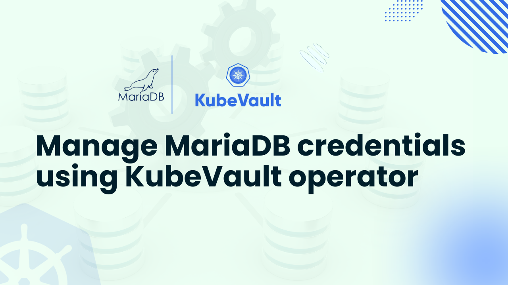

# Manage MariaDB credentials using KubeVault operator



Through the use of HashiCorp Vault's dynamic secrets engine, managing MariaDB credentials with KubeVault offers a safe and automated method of handling database secrets in Kubernetes.  By integrating directly with Vault, KubeVault can create policy-driven, temporary MariaDB credentials on demand, eliminating the need for hardcoded credentials or static Kubernetes Secrets.  This gives teams the option to enforce least privilege access and automatically cycle credentials without downtime, while also removing the dangers associated with long-lived passwords and human secret management.

Utilizing KubeVault's dynamic secret engine, manage MariaDB credentials using Kubevault to do away with static secrets. This allows for automatic credential generation, rotation, revocation, and policy-based access control to be implemented right within Kubernetes for safe and legal database operations.

KubeVault allows Kubernetes-based applications to easily request MariaDB credentials, which are provisioned as Kubernetes Secrets automatically and maintained current throughout the application's lifecycle.  By managing rotation and revocation in accordance with time-to-live criteria, Vault makes sure that compromised credentials are promptly rendered invalid.  For production-grade MariaDB setups, this method improves security posture, auditability, and compliance while significantly lowering operational overhead for DevOps and database teams.

Organizations may standardize secret management across teams and environments without altering how applications use credentials by using KubeVault for MariaDB.  The credentials that developers previously acquired from Kubernetes Secrets are constantly issued, rotated, and revoked by Vault behind the scenes.  This paradigm makes it easier to confidently manage large-scale, cloud-native MariaDB deployments by streamlining procedures and enhancing security.

## Why Use KubeVault for MariaDB Secrets Management

KubeVault enables a contemporary, automated method of managing MariaDB secrets by integrating the capabilities of HashiCorp Vault into Kubernetes.  KubeVault provides dynamic, transient MariaDB credentials that are dynamically generated and cycled by Vault, as opposed to static credentials saved as plain Kubernetes Secrets.  Because passwords expire fast and are no longer required to be manually handled or embedded in configuration files or container images, this method significantly lowers the danger of credential breaches or misuse.

To streamline database security, manage MariaDB credentials using KubeVault. Credentials are automatically cycled, issued on demand, and secured by Vault without requiring manual secret management or downtime.  Credentials are still used by applications like standard Kubernetes Secrets, but they are automatically updated with Vault.  Policies in Vault define who can access what, ensuring least-privilege access for developers, CI/CD pipelines, and services.  This reduces human mistake, does away with manual interventions during rotations, and guarantees that credentials are always current without generating downtime.

Additionally, KubeVault improves auditability and compliance, two important aspects of production-grade MariaDB systems.  Vault provides a complete audit trail by recording each request for a secret, credential rotation, and revocation.  As a result, companies can more easily comply with legal obligations while upholding robust security procedures.  All things considered, KubeVault makes managing MariaDB credentials easier, improves security posture, and frees up teams to concentrate on providing features rather than manually managing private information.

## Deploy Vault on Kubernetes
### Pre-requisites

HashiCorp Vault addresses the shortcomings of Kubernetes' native Secrets by offering a reliable method for handling sensitive data, such as database access, API keys, and passwords.   Unlike normal Kubernetes Secrets, Vault offers enterprise-grade security with encryption, fine-grained access control, dynamic credential generation, and automated rotation.   It provides thorough audit logs, many authentication choices, and a seamless interaction with Kubernetes to meet compliance requirements.

You must configure your environment to manage MariaDB credentials using [KubeVault](https://kubevault.com/) operator before you can deploy Vault in Kubernetes.

Prerequisites:

- Familiarity with [Vault](https://developer.hashicorp.com/vault) and Kubernetes concepts such as clusters, pods, services, and secrets.

- A running Kubernetes cluster (this guide uses [Kind](https://kubernetes.io/docs/tasks/tools/#kind))).

- [Helm](https://helm.sh/docs/intro/install/) installed on your system.

Once these requirements are met, you can use KubeVault to deploy HashiCorp Vault in Kubernetes.  Ensure that KubeVault is already configured in your cluster before starting.  Using your cluster ID, you can get a free license from the [AppsCode License Server](https://license-issuer.appscode.com/).  Use the following command to get the cluster ID:

```bash
$ kubectl get ns kube-system -o jsonpath='{.metadata.uid}'
e5b4a1a0-5a67-4657-b370-db7200108cae
```

After providing the necessary information and hitting the submit button, the license server will email a "license.txt" file. To install KubeVault, run the following commands:

```bash
$ helm install kubevault oci://ghcr.io/appscode-charts/kubevault \
  --version v2025.2.10 \
  --namespace kubevault --create-namespace \
  --set-file global.license=/path/to/the/license.txt \
  --wait --burst-limit=10000 --debug
```


Verify the installation by the following command:

```bash
$ kubectl get pods --all-namespaces -l "app.kubernetes.io/instance=kubevault"
NAMESPACE   NAME                                                  READY   STATUS    RESTARTS   AGE
kubevault   kubevault-kubevault-operator-f89555d55-rwf49          1/1     Running   0          64m
kubevault   kubevault-kubevault-webhook-server-6497bb6d69-4wvpr   1/1     Running   0          64m
``` 
Within a short time all the pods in kubevault namespace will start running. If all pod statuses are running, we can move on to the next phase.

For any confusion regarding KubeVault installation, you can follow the [KubeVault-Setup](https://kubevault.com/docs/latest/setup/) page.

### Create a Namespace
After that, we'll create a new namespace in which we will deploy Vault Server. In this case, we have created vault-demo namespace, but you can create namespace with any name that you want. To create the namespace, we can use the following command:

```bash
$ kubectl create namespace demo
namespace/demo created
``` 

### Deploy VaultServer via Kubernetes KubeVault operator
We need to create a yaml configuration to deploy HashiCorp Vault Server on Kubernetes. We will apply the following yaml:

```yaml
apiVersion: kubevault.com/v1alpha2
kind: VaultServer
metadata:
  name: vault
  namespace: demo
spec:
  allowedSecretEngines:
    namespaces:
      from: All
  version: 1.18.4
  replicas: 3
  backend:
    raft:
      storage:
        storageClassName: "standard"
        resources:
          requests:
            storage: 1Gi
  unsealer:
    secretShares: 5
    secretThreshold: 3
    mode:
      kubernetesSecret:
        secretName: vault-keys
  terminationPolicy: WipeOut
```

In this yaml,

- `spec.replicas` specifies the number of Vault nodes to deploy. It has to be a positive number. Note: Amazon EKS does not support HA for Vault. As we using Amazon EKS as our backend it has to be 1.
- `spec.version` specifies the name of the VaultServerVersion CRD. This CRD holds the image name and version of the Vault, Unsealer, and Exporter.
- `spec.allowedSecretEngines` defines the Secret Engine informations which to be granted in this Vault Server.
- `spec.backend` is a required field that contains the Vault backend storage configuration.
- `spec.unsealer` specifies Unsealer configuration. Unsealer handles automatic initializing and unsealing of Vault.
- `spec.terminationPolicy` field is Wipeout means that vault will be deleted without restrictions. It can also be “Halt”, “Delete” and “DoNotTerminate”. [Follow this guide to learn more about KubeVault's termination policy](https://kubevault.com/docs/v2025.2.10/concepts/vault-server-crds/vaultserver/#specterminationpolicy).

We will save this yaml configuration to `vault.yaml`. Then create the above HashiCorp Vault Server object.

```bash
$ kubectl apply -f vault.yaml
vaultserver.kubevault.com/vault created
```

This will create a `VaultServer` custom resource. The KubeVault Kubernetes Operator will watch this and create three HashiCorp Vault Server pods in the specified namespace.
If all the above steps are handled correctly and the Vault is deployed, you will see that the following objects are created:

```bash
$ kubectl get pod,vaultserver -n demo
NAME                     READY   STATUS    RESTARTS   AGE
pod/vault-0              2/2     Running   0          7m5s
pod/vault-1              2/2     Running   0          6m39s
pod/vault-2              2/2     Running   0          6m15s

NAME                              REPLICAS   VERSION   STATUS   AGE
vaultserver.kubevault.com/vault   3          1.18.4    Ready    7m29s
```

We have successfully deployed Vault in Kubernetes with the Kubernetes KubeVault operator. Now, we will connect to the deployed Vault Server and verify whether it is usable or not. First, check the status,

```bash
$ kubectl get vaultserver -n demo
NAME    REPLICAS   VERSION   STATUS   AGE
vault   3          1.12.1    Ready    5m48s
```

From the output above, we can see that the `VaultServer` is ready to use.

## Install KubeDB on Kubernetes

To set up KubeDB in our Kubernetes cluster, we need a license. Through the Appscode License Server, we can get a free enterprise license. We must provide our Kubernetes cluster ID to obtain a license. Run the following command below to get the cluster ID.

```bash
$ kubectl get ns kube-system -o jsonpath='{.metadata.uid}'
e5b4a1a0-5a67-4657-b370-db7200108cae
```

The license server will email us with a “license.txt” file attached after we provide the necessary data. Run the following commands listed below to install KubeDB.

```bash
$ helm install kubedb oci://ghcr.io/appscode-charts/kubedb \
  --version v2025.4.30 \
  --namespace kubedb --create-namespace \
  --set-file global.license=/path/to/the/license.txt \
  --wait --burst-limit=10000 --debug
```

Verify the installation by the following command,

```bash
kubectl get pods --all-namespaces -l "app.kubernetes.io/instance=kubedb"
NAMESPACE   NAME                                           READY   STATUS    RESTARTS   AGE
kubedb      kubedb-kubedb-autoscaler-0                     1/1     Running   0          6m3s
kubedb      kubedb-kubedb-ops-manager-0                    1/1     Running   0          6m3s
kubedb      kubedb-kubedb-provisioner-0                    1/1     Running   0          6m3s
kubedb      kubedb-kubedb-webhook-server-fb76b7889-qf4ng   1/1     Running   0          6m3s
kubedb      kubedb-petset-5dbd674f4b-hnmwj                 1/1     Running   0          6m3s
kubedb      kubedb-sidekick-6756758dd6-zl5w5               1/1     Running   0          6m3s

```

## Create a MariaDB database

We need to create a yaml manifest to install MariaDB on Kubernetes. And we will apply this yaml below,

```bash
apiVersion: kubedb.com/v1
kind: MariaDB
metadata:
  name: mariadb-quickstart
  namespace: demo
spec:
  deletionPolicy: Delete
  storage:
    accessModes:
    - ReadWriteOnce
    resources:
      requests:
        storage: 1Gi
    storageClassName: standard
  storageType: Durable
  version: 11.1.3
```

We will save this yaml configuration to mariadb.yaml. Then create the above MariaDB object.

```bash
$ kubectl apply -f mariadb.yaml
mariadb.kubedb.com/mariadb-quickstart created
```

If all the above steps are handled correctly and the MariaDB is deployed, you will see that the following objects are created:

```bash
$ kubectl get pod,mariadb -n demo
NAME                        READY   STATUS    RESTARTS   AGE
pod/mariadb-quickstart-0      1/1     Running   0          2m59s


NAME                                    VERSION   STATUS   AGE
mariadb.kubedb.com/mariadb-quickstart       6.2.14    Ready    3m2s

```

## Manage MariaDB credentials using KubeVault

### Enable and Configure MariaDB Secret Engine

When a [SecretEngine](https://kubevault.com/docs/v2025.5.30/concepts/secret-engine-crds/secretengine/) crd object is created, the KubeVault operator will enable a secret engine on specified path and configure the secret engine with given configurations.

A sample SecretEngine object for the MariaDB secret engine:

```yaml
apiVersion: engine.kubevault.com/v1alpha1
kind: SecretEngine
metadata:
  name: mariadb-secret-engine
  namespace: demo
spec:
  vaultRef:
    name: vault
    namespace: demo
  mariadb:
    databaseRef:
      name: mariadb-quickstart
      namespace: demo
    pluginName: "mysql-database-plugin"
```

Let's deploy SecretEngine:

```bash
$ kubectl apply -f mariadb-secretengine.yaml
secretengine.engine.kubevault.com/mariadb-secret-engine created
```

Wait till the status become `Success`:

```bash
$ kubectl get secretengine -n demo
NAME                      STATUS    AGE
mariadb-secret-engine     Success   10s
```

Since the status is `Success`, the MariaDB secret engine is enabled and successfully configured. You can use `kubectl describe secretengine -n <namepsace> <name>` to check for error events, if any.

### Create MariaDB Role

By using [MariaDBRole](https://kubevault.com/docs/v2025.5.30/concepts/secret-engine-crds/database-secret-engine/mariadb/#mariadbrole-crd-specification), you can create a role on the Vault server in Kubernetes native way.

A sample MariaDBRole object is given below:

```yaml
apiVersion: engine.kubevault.com/v1alpha1
kind: MariaDBRole
metadata:
  name: mariadb-role
  namespace: demo
spec:
  secretEngineRef:
    name: mariadb-secret-engine
  creationStatements:
    - "CREATE USER '{{name}}'@'%' IDENTIFIED BY '{{password}}';"
    - "GRANT SELECT ON *.* TO '{{name}}'@'%';"
  defaultTTL: 1h
  maxTTL: 24h
```

Let's deploy MariaDBRole:

```bash
$ kubectl apply -f mariadbrole.yaml
mariadbrole.engine.kubevault.com/mariadb-role created

$ kubectl get mariadbrole -n demo
NAME           STATUS    AGE
mariadb-role     Success   34m
```

You can also check from Vault that the role is created.
To resolve the naming conflict, name of the role in Vault will follow this format: `k8s.{clusterName}.{metadata.namespace}.{metadata.name}`.

> Don't have Vault CLI? [Download and configure](https://kubevault.com/docs/v2025.5.30/guides/vault-server/vault-server/#enable-vault-cli) it as described.

```bash
$ vault secrets list
Path                 Type         Accessor              Description
you-database-path    database     database_cac6c5ee     n/a


$ vault list your-database-path/roles
Keys
----
k8s.-.demo.mariadb-role

$ vault read your-database-path/roles/k8s.-.demo.mariadb-role
Key                      Value
---                      -----
creation_statements      [CREATE USER '{{name}}'@'%' IDENTIFIED BY '{{password}}'; GRANT SELECT ON *.* TO '{{name}}'@'%';]
credential_type          password
db_name                  k8s.9b6fcff6-f32b-4072-81e1-a70d32f1a12f.demo.mariadb-quickstart
default_ttl              1h
max_ttl                  24h
renew_statements         []
revocation_statements    []
rollback_statements      []
```

If we delete the MariaDB, then the respective role will be deleted from the Vault.

```bash
$ kubectl delete mariadbrole -n demo mariadb-role
mariadbrole.engine.kubevault.com "mariadb-role" deleted
```

Check from Vault whether the role exists:

```bash
$ vault read your-database-path/roles/k8s.-.demo.mariadb-role
No value found at your-database-path/roles/k8s.-.demo.mariadb-role

$ vault list your-database-path/roles
No value found at your-database-path/roles/
```

### Generate MariaDB credentials

Here, we are going to make a request to Vault for MariaDB credentials by creating `mariadb-access-req` SecretAccessRequest in `demo` namespace.

```yaml
apiVersion: engine.kubevault.com/v1alpha1
kind: SecretAccessRequest
metadata:
  name: mariadb-access-req
  namespace: demo
spec:
  roleRef:
    kind: MariaDBRole
    name: mariadb-role
    namespace: demo
  subjects:
    - kind: ServiceAccount
      name: demo-sa
      namespace: demo
```

Here, `spec.roleRef` is the reference of MariaDB against which credentials will be issued. `spec.subjects` is the reference to the object or user identities a role binding applies to it will have read access of the credential secret.

Now, we are going to create SecretAccessRequest.

```bash
$ kubectl apply -f mariadbSecretAccessRequest.yaml
secretaccessrequest.engine.kubevault.com/mariadb-access-req created

$ kubectl get secretaccessrequest -n demo
NAME                 AGE
mariadb-access-req     72m
```

Database credentials will not be issued until it is approved. The KubeVault operator will watch for the approval in the `status.conditions[].type` field of the request object. You can use [KubeVault CLI](https://github.com/kubevault/cli), a [kubectl plugin](https://kubernetes.io/docs/tasks/extend-kubectl/kubectl-plugins/), to approve or deny SecretAccessRequest.

```bash
# using KubeVault CLI as kubectl plugin to approve request
$ kubectl vault approve secretaccessrequest mariadb-access-req -n demo
secretaccessrequests mariadb-access-req approved


$ kubectl get secretaccessrequest -n demo mariadb-access-req -o yaml
apiVersion: engine.kubevault.com/v1alpha1
kind: SecretAccessRequest
metadata:
  annotations:
    kubectl.kubernetes.io/last-applied-configuration: |
      {"apiVersion":"engine.kubevault.com/v1alpha1","kind":"SecretAccessRequest","metadata":{"annotations":{},"name":"mariadb-access-req","namespace":"demo"},"spec":{"roleRef":{"kind":"MariaDBRole","name":"mariadb-role","namespace":"demo"},"subjects":[{"kind":"ServiceAccount","name":"demo-sa","namespace":"demo"}]}}
    vaultservers.kubevault.com/name: vault
    vaultservers.kubevault.com/namespace: demo
  creationTimestamp: "2025-08-08T07:02:45Z"
  finalizers:
  - kubevault.com
  generation: 1
  name: mariadb-access-req
  namespace: demo
  resourceVersion: "95423"
  uid: 4d00e64f-bda5-4b33-8312-e3680be86bab
spec:
  roleRef:
    kind: MariaDBRole
    name: mariadb-role
    namespace: demo
  subjects:
  - kind: ServiceAccount
    name: demo-sa
    namespace: demo
status:
  conditions:
  - lastTransitionTime: "2025-08-08T07:03:33Z"
    message: 'This was approved by: kubectl vault approve secretaccessrequest'
    observedGeneration: 1
    reason: KubectlApprove
    status: "True"
    type: Approved
  - lastTransitionTime: "2025-08-08T07:03:33Z"
    message: The requested credentials successfully issued.
    observedGeneration: 1
    reason: SuccessfullyIssuedCredential
    status: "True"
    type: Available
  lease:
    duration: 1h0m0s
    id: k8s.9b6fcff6-f32b-4072-81e1-a70d32f1a12f.mariadb.demo.mariadb-secret-engine/creds/k8s.9b6fcff6-f32b-4072-81e1-a70d32f1a12f.demo.mariadb-role/5VCEcJkQLK3KtKZ86KePZaFZ
    renewable: true
  observedGeneration: 1
  phase: Approved
  secret:
    name: mariadb-access-req-feuq0s
    namespace: demo
```

Once SecretAccessRequest is approved, the KubeVault operator will issue credentials from Vault and create a secret containing the credential. It will also create a role and rolebinding so that `spec.subjects` can access secret. You can view the information in the `status` field.

```bash
$ kubectl get secretaccessrequest mariadb-access-req -n demo -o json | jq '.status'
{
  "conditions": [
    {
      "lastTransitionTime": "2025-08-08T07:03:33Z",
      "message": "This was approved by: kubectl vault approve secretaccessrequest",
      "observedGeneration": 1,
      "reason": "KubectlApprove",
      "status": "True",
      "type": "Approved"
    },
    {
      "lastTransitionTime": "2025-08-08T07:03:33Z",
      "message": "The requested credentials successfully issued.",
      "observedGeneration": 1,
      "reason": "SuccessfullyIssuedCredential",
      "status": "True",
      "type": "Available"
    }
  ],
  "lease": {
    "duration": "1h0m0s",
    "id": "k8s.9b6fcff6-f32b-4072-81e1-a70d32f1a12f.mariadb.demo.mariadb-secret-engine/creds/k8s.9b6fcff6-f32b-4072-81e1-a70d32f1a12f.demo.mariadb-role/5VCEcJkQLK3KtKZ86KePZaFZ",
    "renewable": true
  },
  "observedGeneration": 1,
  "phase": "Approved",
  "secret": {
    "name": "mariadb-access-req-feuq0s",
    "namespace": "demo"
  }
}

```

```bash
$ kubectl get secret -n demo mariadb-access-req-feuq0s -o yaml
apiVersion: v1
data:
  password: VFotbUN3S1JnaVRyUnhIRHQzblc=
  username: di1rdWJlcm5ldGVzLWs4cy45YjZmY2YtOFk0U2RLNlg=
kind: Secret
metadata:
  creationTimestamp: "2025-08-08T07:03:33Z"
  name: mariadb-access-req-feuq0s
  namespace: demo
  ownerReferences:
  - apiVersion: engine.kubevault.com/v1alpha1
    blockOwnerDeletion: true
    controller: true
    kind: SecretAccessRequest
    name: mariadb-access-req
    uid: 4d00e64f-bda5-4b33-8312-e3680be86bab
  resourceVersion: "95419"
  uid: 807ea614-ae4d-4a74-9614-87bd9033bd74
type: Opaque
```

If SecretAccessRequest is deleted, then credential lease (if any) will be revoked.

```bash
$ kubectl delete secretaccessrequest -n demo mariadb-access-req-feuq0s
secretaccessrequest.engine.kubevault.com "mariadb-access-req-feuq0s" deleted
```

If SecretAccessRequest is `Denied`, then the KubeVault operator will not issue any credential.

```bash
$ kubectl vault deny secretaccessrequest mariadb-access-req-feuq0s -n demo
  Denied
```

## Conclusion

Teams can handle database secrets in a secure, automated, and centralized manner by opting to manage MariaDB credentials using KubeVault. This lowers risk and conforms to contemporary DevOps and compliance procedures. MariaDB's built-in security features, when used appropriately, provide a strong enterprise-grade basis for safeguarding vital data infrastructure.  This talk has shown how MariaDB's security system, which includes auditing, encryption, authorization, and authentication, builds a multi-layered protection for the database environment.  Teams may improve this foundation with dynamic secrets management, automated credential rotation, and policy-driven access by integrating KubeVault for MariaDB credential management. This will drastically lower the risks related to static secrets.

We have looked at how HashiCorp Vault's secrets engine integrates with MariaDB's built-in security features, ranging from simple authentication to more sophisticated choices like field-level encryption and safe network isolation.  KubeVault offers a centralized, automated method of credential lifecycle management by extending Vault's functionality straight into Kubernetes.  A strong, defense-in-depth security model that complies with contemporary compliance standards is produced by combining MariaDB's TLS/SSL and access controls with Vault's RBAC and secret rotation.

Administrators may preserve MariaDB's performance and dependability while managing secrets in a uniform manner by integrating KubeVault into MariaDB operations.  This combination allows for the agility needed for today's cloud-native apps while guaranteeing the security of sensitive data.

## Next Steps

Expand your secrets management expertise with these related guides:
-  Learn how to [manage PostgreSQL credentials using KubeVault](https://kubevault.com/articles/manage-postgresql-credentials-using-kubevault-operator/).
-  [Manage Redis credentials using KubeVault](https://kubevault.com/articles/manage-redis-credentials-using-kubevault-operator/) with automated role-based access.
- Learn how to [manage MongoDB credentials using KubeVault]((https://kubevault.com/articles/manage-mongodb-credentials-using-kubevault-operator/)) for secret management.