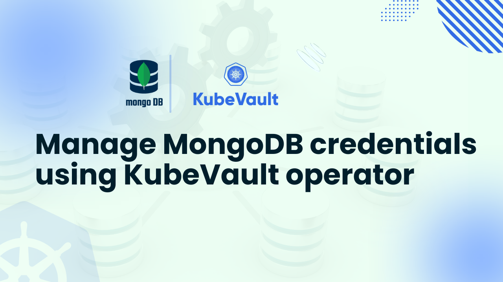

# Manage MongoDB credentials using KubeVault operator



Managing MongoDB credentials using KubeVault has emerged as the industry standard for attaining enterprise-grade security while preserving operational effectiveness, particularly for MongoDB, where misuse of secrets can result in operational hazards, data breaches, and compliance violations.  Traditional approaches, such as using base64-encoded Kubernetes Secrets or hardcoding credentials, are not scalable or secure enough. Manage MongoDB credentials using KubeVault to take advantage of Kubernetes' interaction with HashiCorp Vault's robust secrets engine, which makes automated, dynamic, and policy-driven credential management possible.

Employing KubeVault allows enterprises to automate credential rotation, enforce least-privilege access, and get rid of static secrets while still being seamlessly compatible with Kubernetes operations.  This method is perfect for DevOps teams, security engineers, and database administrators overseeing production-grade MongoDB deployments since it streamlines human overhead while simultaneously improving security posture.

## Why Use KubeVault for MongoDB Secrets Management

Static database credentials are a ticking time bomb in the current threat landscape because they can be abused, leaked, or accessed by unauthorized parties. By directly integrating HashiCorp Vault's dynamic secrets engine into Kubernetes, KubeVault revolutionizes MongoDB secrets management by guaranteeing that credentials are never statically kept but are instead produced for apps as needed. When you manage MongoDB credentials using KubeVault, you unlock military-grade encryption and automated rotation - a stark contrast to conventional Kubernetes Secrets that only offer base64 encoding.

DevOps teams no longer need to manually update their credentials or use dangerous hardcoded secrets in YAML files.  One of the main advantages of utilizing KubeVault to manage MongoDB credentials is that when applications dynamically request temporary credentials that expire automatically, the blast radius of possible breaches drastically reduces.  Every secret request is auditable and linked to Kubernetes Service Accounts or namespaces, giving security teams fine-grained, policy-based access control.  As KubeVault enforces least-privilege access and effortlessly integrates with MongoDB's authentication mechanisms (such as SCRAM-SHA-256), database administrators can relax.

Beyond security, KubeVault simplifies compliance with standards like HIPAA and GDPR by maintaining detailed audit logs of secret access. To properly manage MongoDB credentials using KubeVault means achieving centralized secrets management across any infrastructure - whether running MongoDB on-premises or in cloud platforms (EKS, AKS, GKE). The result? A production-ready solution that delivers enterprise security without compromising Kubernetes' operational agility.

## Deploy Vault on Kubernetes
### Pre-requisites

HashiCorp Vault overcomes the shortcomings of Kubernetes' native Secrets by offering a reliable method for handling sensitive data, such as database access, API keys, and passwords.   Unlike normal Kubernetes Secrets, Vault offers enterprise-grade security with encryption, fine-grained access control, dynamic credential generation, and automated rotation.   It provides thorough audit logs, many authentication choices, and a seamless interaction with Kubernetes to meet compliance requirements.

You must configure the environment using the [KubeVault](https://kubevault.com/) operator in order to deploy Vault in Kubernetes:

- Basic knowledge of [Vault](https://developer.hashicorp.com/vault) and Kubernetes (cluster, pod, service, secret).

- A Kubernetes cluster (we'll use [Kind](https://kubernetes.io/docs/tasks/tools/#kind)).

- [Helm](https://helm.sh/docs/intro/install/) installed.

HashiCorp Vault will now be deployed in Kubernetes using KubeVault.   Make sure KubeVault is set up in your Kubernetes cluster before you begin, though.  You can obtain a free license from the [AppsCode License Server](https://license-issuer.appscode.com/) by using your Kubernetes cluster ID.   To obtain your cluster ID, use this command:

```bash
$ kubectl get ns kube-system -o jsonpath='{.metadata.uid}'
e5b4a1a0-5a67-4657-b370-db7200108cae
```

After providing the necessary information and hitting the submit button, the license server will email a "license.txt" file. To install KubeVault, run the following commands:

```bash
$ helm install kubevault oci://ghcr.io/appscode-charts/kubevault \
  --version v2025.2.10 \
  --namespace kubevault --create-namespace \
  --set-file global.license=/path/to/the/license.txt \
  --wait --burst-limit=10000 --debug
```


Verify the installation by the following command:

```bash
$ kubectl get pods --all-namespaces -l "app.kubernetes.io/instance=kubevault"
NAMESPACE   NAME                                                  READY   STATUS    RESTARTS   AGE
kubevault   kubevault-kubevault-operator-f89555d55-rwf49          1/1     Running   0          64m
kubevault   kubevault-kubevault-webhook-server-6497bb6d69-4wvpr   1/1     Running   0          64m
``` 
Within a short time all the pods in kubevault namespace will start running. If all pod statuses are running, we can move on to the next phase.

For any confusion regarding KubeVault installation, you can follow the [KubeVault-Setup](https://kubevault.com/docs/latest/setup/) page.

### Create a Namespace
After that, we'll create a new namespace in which we will deploy Vault Server. In this case, we have created vault-demo namespace, but you can create namespace with any name that you want. To create the namespace, we can use the following command:

```bash
$ kubectl create namespace demo
namespace/demo created
``` 

### Deploy VaultServer via Kubernetes KubeVault operator
We need to create a yaml configuration to deploy HashiCorp Vault Server on Kubernetes. We will apply the following yaml:

```yaml
apiVersion: kubevault.com/v1alpha2
kind: VaultServer
metadata:
  name: vault
  namespace: demo
spec:
  allowedSecretEngines:
    namespaces:
      from: All
  version: 1.18.4
  replicas: 3
  backend:
    raft:
      storage:
        storageClassName: "standard"
        resources:
          requests:
            storage: 1Gi
  unsealer:
    secretShares: 5
    secretThreshold: 3
    mode:
      kubernetesSecret:
        secretName: vault-keys
  terminationPolicy: WipeOut
```

In this yaml,

- `spec.replicas` specifies the number of Vault nodes to deploy. It has to be a positive number. Note: Amazon EKS does not support HA for Vault. As we using Amazon EKS as our backend it has to be 1.
- `spec.version` specifies the name of the VaultServerVersion CRD. This CRD holds the image name and version of the Vault, Unsealer, and Exporter.
- `spec.allowedSecretEngines` defines the Secret Engine informations which to be granted in this Vault Server.
- `spec.backend` is a required field that contains the Vault backend storage configuration.
- `spec.unsealer` specifies Unsealer configuration. Unsealer handles automatic initializing and unsealing of Vault.
- `spec.terminationPolicy` field is Wipeout means that vault will be deleted without restrictions. It can also be “Halt”, “Delete” and “DoNotTerminate”. [Follow this guide to learn more about KubeVault's termination policy](https://kubevault.com/docs/v2025.2.10/concepts/vault-server-crds/vaultserver/#specterminationpolicy).

We will save this yaml configuration to `vault.yaml`. Then create the above HashiCorp Vault Server object.

```bash
$ kubectl apply -f vault.yaml
vaultserver.kubevault.com/vault created
```

This will create a `VaultServer` custom resource. The KubeVault Kubernetes Operator will watch this and create three HashiCorp Vault Server pods in the specified namespace.
If all the above steps are handled correctly and the Vault is deployed, you will see that the following objects are created:

```bash
$ kubectl get pod,vaultserver -n demo
NAME                     READY   STATUS    RESTARTS   AGE
pod/vault-0              2/2     Running   0          7m5s
pod/vault-1              2/2     Running   0          6m39s
pod/vault-2              2/2     Running   0          6m15s

NAME                              REPLICAS   VERSION   STATUS   AGE
vaultserver.kubevault.com/vault   3          1.18.4    Ready    7m29s
```

We have successfully deployed Vault in Kubernetes with the Kubernetes KubeVault operator. Now, we will connect to the deployed Vault Server and verify whether it is usable or not. First, check the status,

```bash
$ kubectl get vaultserver -n demo
NAME    REPLICAS   VERSION   STATUS   AGE
vault   3          1.12.1    Ready    5m48s
```

From the output above, we can see that the `VaultServer` is ready to use.

## Install KubeDB on Kubernetes

To set up KubeDB in our Kubernetes cluster, we need a license. Through the Appscode License Server, we can get a free enterprise license. We must provide our Kubernetes cluster ID to obtain a license. Run the following command below to get the cluster ID.

```bash
$ kubectl get ns kube-system -o jsonpath='{.metadata.uid}'
e5b4a1a0-5a67-4657-b370-db7200108cae
```

The license server will email us with a “license.txt” file attached after we provide the necessary data. Run the following commands listed below to install KubeDB.

```bash
$ helm install kubedb oci://ghcr.io/appscode-charts/kubedb \
  --version v2025.4.30 \
  --namespace kubedb --create-namespace \
  --set-file global.license=/path/to/the/license.txt \
  --wait --burst-limit=10000 --debug
```

Verify the installation by the following command,

```bash
kubectl get pods --all-namespaces -l "app.kubernetes.io/instance=kubedb"
NAMESPACE   NAME                                           READY   STATUS    RESTARTS   AGE
kubedb      kubedb-kubedb-autoscaler-0                     1/1     Running   0          6m3s
kubedb      kubedb-kubedb-ops-manager-0                    1/1     Running   0          6m3s
kubedb      kubedb-kubedb-provisioner-0                    1/1     Running   0          6m3s
kubedb      kubedb-kubedb-webhook-server-fb76b7889-qf4ng   1/1     Running   0          6m3s
kubedb      kubedb-petset-5dbd674f4b-hnmwj                 1/1     Running   0          6m3s
kubedb      kubedb-sidekick-6756758dd6-zl5w5               1/1     Running   0          6m3s

```

# Create a MongoDB server

We need to create a yaml manifest to install MongoDB on Kubernetes. And we will apply this yaml below,

```bash
apiVersion: kubedb.com/v1
kind: MongoDB
metadata:
  name: mongodb-quickstart
  namespace: demo
spec:
  deletionPolicy: Delete
  storage:
    accessModes:
    - ReadWriteOnce
    resources:
      requests:
        storage: 1Gi
    storageClassName: standard
  storageType: Durable
  version: 6.0.12
```

We will save this yaml configuration to mongodb.yaml. Then create the above MongoDB object.

```bash
$ kubectl apply -f mongodb.yaml
mongodb.kubedb.com/mongodb-quickstart created
```

If all the above steps are handled correctly and the MongoDB is deployed, you will see that the following objects are created:

```bash
$ kubectl get pod,mongodb -n demo
NAME                        READY   STATUS    RESTARTS   AGE
pod/mongodb-quickstart-0    1/1     Running   0          2m59s


NAME                                    VERSION   STATUS   AGE
mongodb.kubedb.com/mongodb-quickstart   6.2.14    Ready    3m2s

```

## Manage MongoDB credentials using KubeVault

### Enable and Configure MongoDB Secret Engine

When a [SecretEngine](https://kubevault.com/docs/v2025.5.30/concepts/secret-engine-crds/secretengine/) crd object is created, the KubeVault operator will enable a secret engine on specified path and configure the secret engine with given configurations.

A sample SecretEngine object for the MongoDB secret engine:

```yaml
apiVersion: engine.kubevault.com/v1alpha1
kind: SecretEngine
metadata:
  name: mongodb-secret-engine
  namespace: demo
spec:
  vaultRef:
    name: vault
    namespace: demo
  mongodb:
    databaseRef:
      name: mongodb-quickstart
      namespace: demo
    pluginName: "mongodb-database-plugin"
```

Let's deploy SecretEngine:

```bash
$ kubectl apply -f mongodb-secretengine.yaml
secretengine.engine.kubevault.com/mongodb-secret-engine created
```

Wait till the status become `Success`:

```bash
$ kubectl get secretengine -n demo
NAME                    STATUS    AGE
mongodb-secret-engine   Success   10s
```

Since the status is `Success`, the MongoDB secret engine is enabled and successfully configured. You can use `kubectl describe secretengine -n <namepsace> <name>` to check for error events, if any.

### Create MongoDB Role

By using [MongoDBRole](https://kubevault.com/docs/v2025.5.30/concepts/secret-engine-crds/database-secret-engine/mongodb/#mongodbrole-crd-specification), you can create a role on the Vault server in Kubernetes native way.

A sample MongoDBRole object is given below:

```yaml
apiVersion: engine.kubevault.com/v1alpha1
kind: MongoDBRole
metadata:
  name: mongodb-role
  namespace: demo
spec:
  secretEngineRef:
    name: mongodb-secret-engine
  creationStatements:
    - "{ \"db\": \"admin\", \"roles\": [{ \"role\": \"readWrite\" }, {\"role\": \"read\", \"db\": \"foo\"}] }"

  defaultTTL: 1h
  maxTTL: 24h
```

Let's deploy MongoDBRole:

```bash
$ kubectl apply -f mongodbrole.yaml
mongodbrole.engine.kubevault.com/mongodb-role created

$ kubectl get mongodbrole -n demo
NAME           STATUS    AGE
mongodb-role   Success   34m
```

You can also check from Vault that the role is created.
To resolve the naming conflict, name of the role in Vault will follow this format: `k8s.{clusterName}.{metadata.namespace}.{metadata.name}`.

> Don't have Vault CLI? [Download and configure](https://kubevault.com/docs/v2025.5.30/guides/vault-server/vault-server/#enable-vault-cli) it as described.

```bash
$ vault secrets list
Path                 Type         Accessor              Description
you-database-path    database     database_cac6c5ee     n/a


$ vault list your-database-path/roles
Keys
----
k8s.-.demo.mongodb-role

$ vault read your-database-path/roles/k8s.-.demo.mongodb-role
Key                      Value
---                      -----
creation_statements      [{ "db": "admin", "roles": [{ "role": "readWrite" }, {"role": "read", "db": "foo"}] }]
credential_type          password
db_name                  k8s.aff2b01f-2e23-426d-bd47-dfbae5a82163.demo.mongodb-quickstart
default_ttl              1h
max_ttl                  24h
renew_statements         []
revocation_statements    []
rollback_statements      []
```

If we delete the MongoDB, then the respective role will be deleted from the Vault.

```bash
$ kubectl delete mongodbrole -n demo mongodb-role
mongodbrole.engine.kubevault.com "mongodb-role" deleted
```

Check from Vault whether the role exists:

```bash
$ vault read your-database-path/roles/k8s.-.demo.mongodb-role
No value found at your-database-path/roles/k8s.-.demo.mongodb-role

$ vault list your-database-path/roles
No value found at your-database-path/roles/
```

### Generate MongoDB credentials

Here, we are going to make a request to Vault for MongoDB credentials by creating `mongodb-access-req` SecretAccessRequest in `demo` namespace.

```yaml
apiVersion: engine.kubevault.com/v1alpha1
kind: SecretAccessRequest
metadata:
  name: mongodb-access-req
  namespace: demo
spec:
  roleRef:
    kind: MongoDBRole
    name: mongodb-role
    namespace: demo
  subjects:
    - kind: ServiceAccount
      name: demo-sa
      namespace: demo
```

Here, `spec.roleRef` is the reference of MongoDB against which credentials will be issued. `spec.subjects` is the reference to the object or user identities a role binding applies to it will have read access of the credential secret.

Now, we are going to create SecretAccessRequest.

```bash
$ kubectl apply -f mongodbSecretAccessRequest.yaml
secretaccessrequest.engine.kubevault.com/mongodb-access-req created

$ kubectl get secretaccessrequest -n demo
NAME                 AGE
mongodb-access-req   72m
```

Database credentials will not be issued until it is approved. The KubeVault operator will watch for the approval in the `status.conditions[].type` field of the request object. You can use [KubeVault CLI](https://github.com/kubevault/cli), a [kubectl plugin](https://kubernetes.io/docs/tasks/extend-kubectl/kubectl-plugins/), to approve or deny SecretAccessRequest.

```bash
# using KubeVault CLI as kubectl plugin to approve request
$ kubectl vault approve secretaccessrequest mongodb-access-req -n demo
secretaccessrequests mongodb-access-req approved


$ kubectl get secretaccessrequest -n demo mongodb-access-req -o yaml
apiVersion: engine.kubevault.com/v1alpha1
kind: SecretAccessRequest
metadata:
  annotations:
    kubectl.kubernetes.io/last-applied-configuration: |
      {"apiVersion":"engine.kubevault.com/v1alpha1","kind":"SecretAccessRequest","metadata":{"annotations":{},"name":"mongodb-access-req","namespace":"demo"},"spec":{"roleRef":{"kind":"MongoDBRole","name":"mongodb-role","namespace":"demo"},"subjects":[{"kind":"ServiceAccount","name":"demo-sa","namespace":"demo"}]}}
    vaultservers.kubevault.com/name: vault
    vaultservers.kubevault.com/namespace: demo
  creationTimestamp: "2025-07-17T10:53:46Z"
  finalizers:
  - kubevault.com
  generation: 1
  name: mongodb-access-req
  namespace: demo
  resourceVersion: "162031"
  uid: f889b68d-3ffa-45b7-a64f-e2b2c33d63f8
spec:
  roleRef:
    kind: MongoDBRole
    name: mongodb-role
    namespace: demo
  subjects:
  - kind: ServiceAccount
    name: demo-sa
    namespace: demo
status:
  conditions:
  - lastTransitionTime: "2025-07-17T10:59:37Z"
    message: 'This was approved by: kubectl vault approve secretaccessrequest'
    observedGeneration: 1
    reason: KubectlApprove
    status: "True"
    type: Approved
  - lastTransitionTime: "2025-07-17T10:59:37Z"
    message: The requested credentials successfully issued.
    observedGeneration: 1
    reason: SuccessfullyIssuedCredential
    status: "True"
    type: Available
  lease:
    duration: 1h0m0s
    id: k8s.aff2b01f-2e23-426d-bd47-dfbae5a82163.mongodb.demo.mongodb-secret-engine/creds/k8s.aff2b01f-2e23-426d-bd47-dfbae5a82163.demo.mongodb-role/66Tol2KWIiDDiwI2cfFi3A0L
    renewable: true
  observedGeneration: 1
  phase: Approved
  secret:
    name: mongodb-access-req-aqz8y9
    namespace: demo
```

Once SecretAccessRequest is approved, the KubeVault operator will issue credentials from Vault and create a secret containing the credential. It will also create a role and rolebinding so that `spec.subjects` can access secret. You can view the information in the `status` field.

```bash
$ kubectl get secretaccessrequest mongodb-access-req -n demo -o json | jq '.status'
{
  "conditions": [
    {
      "lastTransitionTime": "2025-07-17T10:59:37Z",
      "message": "This was approved by: kubectl vault approve secretaccessrequest",
      "observedGeneration": 1,
      "reason": "KubectlApprove",
      "status": "True",
      "type": "Approved"
    },
    {
      "lastTransitionTime": "2025-07-17T10:59:37Z",
      "message": "The requested credentials successfully issued.",
      "observedGeneration": 1,
      "reason": "SuccessfullyIssuedCredential",
      "status": "True",
      "type": "Available"
    }
  ],
  "lease": {
    "duration": "1h0m0s",
    "id": "k8s.aff2b01f-2e23-426d-bd47-dfbae5a82163.mongodb.demo.mongodb-secret-engine/creds/k8s.aff2b01f-2e23-426d-bd47-dfbae5a82163.demo.mongodb-role/66Tol2KWIiDDiwI2cfFi3A0L",
    "renewable": true
  },
  "observedGeneration": 1,
  "phase": "Approved",
  "secret": {
    "name": "mongodb-access-req-aqz8y9",
    "namespace": "demo"
  }
}
```

```bash
$ kubectl get secret -n demo mongodb-access-req-aqz8y9 -o yaml
data:
  password: RDVET1VZMVVZSExuLUtjeFFKcko=
  username: di1rdWJlcm5ldGVzLWRlbW8tazhzLWFmZjJiMDFmLTJlLUUwdDFkT0xWb3BFelRTYWlRMFRlLTE3NTI3NDk5Nzc=
kind: Secret
metadata:
  creationTimestamp: "2025-07-17T10:59:37Z"
  name: mongodb-access-req-aqz8y9
  namespace: demo
  ownerReferences:
  - apiVersion: engine.kubevault.com/v1alpha1
    blockOwnerDeletion: true
    controller: true
    kind: SecretAccessRequest
    name: mongodb-access-req
    uid: f889b68d-3ffa-45b7-a64f-e2b2c33d63f8
  resourceVersion: "162027"
  uid: 3f6dcae2-30f8-4676-9fd6-310da5ada820
type: Opaque
```

If SecretAccessRequest is deleted, then credential lease (if any) will be revoked.

```bash
$ kubectl delete secretaccessrequest -n demo mongodb-access-req-aqz8y9
secretaccessrequest.engine.kubevault.com "mongodb-access-req-aqz8y9" deleted
```

If SecretAccessRequest is `Denied`, then the KubeVault operator will not issue any credential.

```bash
$ kubectl vault deny secretaccessrequest mongodb-access-req-aqz8y9 -n demo
  Denied
```

## Conclusion

When correctly deployed, MongoDB's strong native security features provide an enterprise-grade basis for safeguarding your data infrastructure. This investigation has shown how protection is provided at every level of your database environment by MongoDB's all-inclusive security approach, which includes authentication, authorization, encryption, and auditing. For teams looking to elevate this security further, the ability to manage MongoDB credentials using KubeVault adds an essential layer of dynamic secrets management and automated rotation.

We have carefully examined MongoDB's security architecture, including everything from fundamental user authentication processes to more complex features like field-level encryption and network isolation.  These built-in safeguards work in tandem with HashiCorp Vault's enterprise-grade secrets engine to provide a defense-in-depth approach for managing MongoDB credentials with KubeVault.  The platform's comprehensive role-based access control, in conjunction with its TLS/SSL encryption capabilities, establishes a robust security posture that meets modern compliance requirements.

MongoDB offers a security framework that, when set up and maintained correctly, not only safeguards private information but also easily combines with more comprehensive organizational security plans. By learning to manage MongoDB credentials using KubeVault, administrators gain centralized control over credential lifecycle while maintaining MongoDB's performance benefits. You may now deploy MongoDB with confidence, knowing that your data is protected through both native security features and KubeVault-enhanced credential management, preserving the speed and adaptability that make MongoDB so useful for contemporary applications.

## Next Steps

Expand your secrets management expertise with these related guides:
-  Learn how to [manage PostgreSQL credentials using KubeVault](https://kubevault.com/articles/manage-postgresql-credentials-using-kubevault-operator/).
-  [Manage Redis credentials using KubeVault](https://kubevault.com/articles/manage-redis-credentials-using-kubevault-operator/) with automated role-based access. 
