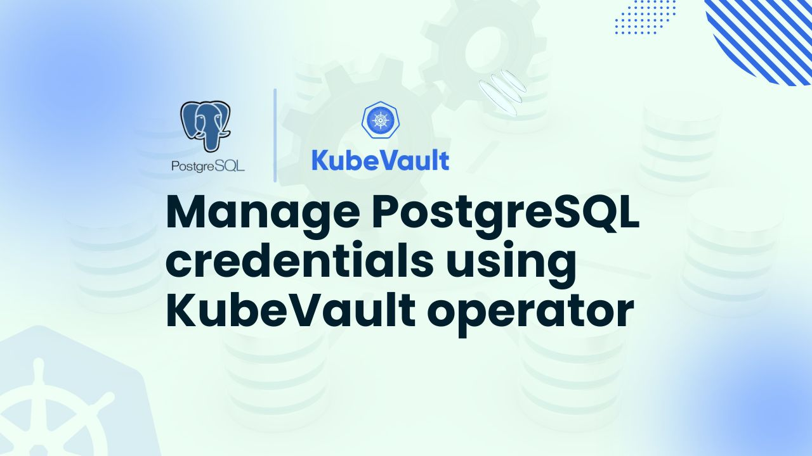

# Manage PostgreSQL credentials using KubeVault operator



In the modern landscape of cloud-native applications, secure storage of sensitive information such as PostgreSQL credentials, API keys, passwords, and certificates is essential. HashiCorp Vault offers solid secret capabilities, and combined with support for Kubernetes, it is managed effortlessly with the KubeVault operator. KubeVault facilitates cloud-native applications by offering a production-grade Kubernetes operator for automating, scaling, and protecting secret storage.

In this article, we will show you how to store and manage PostgreSQL credentials using KubeVault operator. You will see how to store and get PostgreSQL credentials from the Vault in a secure and efficient manner. Whether you're a security expert, a cloud architect, or a DevOps professional, this tutorial will guide you through the necessary steps to deploy a secure solution for managing PostgreSQL secrets in your Kubernetes setup.

## Why Vault in Kubernetes

HashiCorp Vault is a robust open-source secrets management tool designed to protect, store, and manage access to sensitive data, such as database credentials, API keys, passwords, and certificates. It enhances security by offering audit logging, dynamic secrets, access control, and encryption.

While Kubernetes provides a built-in Secrets API, it lacks strong encryption, granular access control, and automatic credential rotation. Vault addresses these limitations by offering end-to-end encryption, dynamic secret generation, and fine-grained policy-based access management. It also supports various authentication mechanisms, including Kubernetes service accounts, AppRole, and OIDC, ensuring secure access to sensitive information. Vault's audit logging and monitoring capabilities help organizations meet compliance requirements.

By running Vault in Kubernetes, particularly through the KubeVault Operator, organizations can seamlessly manage PostgreSQL credentials using KubeVault Operator without the need for complex manual processes. The KubeVault Operator integrates with Kubernetes workloads, allowing applications to retrieve credentials dynamically without code modification. This improves security, automation, and scalability while lowering operational overhead.

Using KubeVault to manage PostgreSQL credentials ensures enhanced security, automatic secret rotation, and simplified management, providing a secure and efficient solution for cloud-native applications.

## Deploy Vault on Kubernetes
### Pre-requisites
To deploy Vault in Kubernetes, we first set up the environment using KubeVault Operator. Along with having a basic understanding of [Vault]((https://www.vaultproject.io/)), you should also be familiar with Kubernetes terminology such as cluster, pod, service, and secret. Here, we'll build our Kubernetes cluster using [Kind]((https://kubernetes.io/docs/tasks/tools/#kind)). [Helm](https://helm.sh/docs/intro/install/) must also be installed on our Kubernetes cluster.

We'll now deploy HashiCorp Vault in Kubernetes using [KubeVault](https://kubevault.com/). However, you need to make sure that KubeVault is already set up in your Kubernetes cluster before you begin. A license is required to use KubeVault on a Kubernetes cluster, and it is available for free from the [Appscode License Server](https://license-issuer.appscode.com/). The Kubernetes cluster ID is required in order to obtain this license. You can use the command we've included below to find this ID.
 
```bash
$ kubectl get ns kube-system -o jsonpath='{.metadata.uid}'
e5b4a1a0-5a67-4657-b370-db7200108cae
```

After providing the necessary information and hitting the submit button, the license server will email a "license.txt" file. To install KubeVault, run the following commands:

```bash
$ helm install kubevault oci://ghcr.io/appscode-charts/kubevault \
  --version v2025.2.10 \
  --namespace kubevault --create-namespace \
  --set-file global.license=/path/to/the/license.txt \
  --wait --burst-limit=10000 --debug
```


Verify the installation by the following command:

```bash
$ kubectl get pods --all-namespaces -l "app.kubernetes.io/instance=kubevault"
NAMESPACE   NAME                                                  READY   STATUS    RESTARTS   AGE
kubevault   kubevault-kubevault-operator-f89555d55-rwf49          1/1     Running   0          64m
kubevault   kubevault-kubevault-webhook-server-6497bb6d69-4wvpr   1/1     Running   0          64m
``` 
Within a short time all the pods in kubevault namespace will start running. If all pod statuses are running, we can move on to the next phase.

For any confusion regarding KubeVault installation, you can follow the [KubeVault-Setup](https://kubevault.com/docs/latest/setup/) page.

### Create a Namespace
After that, we'll create a new namespace in which we will deploy Vault Server. In this case, we have created vault-demo namespace, but you can create namespace with any name that you want. To create the namespace, we can use the following command:

```bash
$ kubectl create namespace vault-demo
namespace/vault-demo created
``` 

### Deploy VaultServer via Kubernetes KubeVault operator
We need to create a yaml configuration to deploy HashiCorp Vault Server on Kubernetes. We will apply the following yaml:

```yaml
apiVersion: kubevault.com/v1alpha2
kind: VaultServer
metadata:
  name: vault
  namespace: vault-demo
spec:
  allowedSecretEngines:
    namespaces:
      from: All
  version: 1.18.4
  replicas: 3
  backend:
    raft:
      storage:
        storageClassName: "standard"
        resources:
          requests:
            storage: 1Gi
  unsealer:
    secretShares: 5
    secretThreshold: 3
    mode:
      kubernetesSecret:
        secretName: vault-keys
  terminationPolicy: WipeOut
```

In this yaml,

- `spec.replicas` specifies the number of Vault nodes to deploy. It has to be a positive number. Note: Amazon EKS does not support HA for Vault. As we using Amazon EKS as our backend it has to be 1.
- `spec.version` specifies the name of the VaultServerVersion CRD. This CRD holds the image name and version of the Vault, Unsealer, and Exporter.
- `spec.allowedSecretEngines` defines the Secret Engine informations which to be granted in this Vault Server.
- `spec.backend` is a required field that contains the Vault backend storage configuration.
- `spec.unsealer` specifies Unsealer configuration. Unsealer handles automatic initializing and unsealing of Vault.
- `spec.terminationPolicy` field is Wipeout means that vault will be deleted without restrictions. It can also be “Halt”, “Delete” and “DoNotTerminate”. Learn More about these [HERE](https://kubevault.com/docs/v2025.2.10/concepts/vault-server-crds/vaultserver/#specterminationpolicy).

We will save this yaml configuration to `vault.yaml`. Then create the above HashiCorp Vault Server object.

```bash
$ kubectl create -f vault.yaml
vaultserver.kubevault.com/vault created
```

This will create a `VaultServer` custom resource. The KubeVault Kubernetes Operator will watch this and create three HashiCorp Vault Server pods in the specified namespace.
If all the above steps are handled correctly and the Vault is deployed, you will see that the following objects are created:

```bash
$ kubectl get all -n vault-demo
NAME          READY   STATUS    RESTARTS   AGE
pod/vault-0   2/2     Running   0          4m7s
pod/vault-1   2/2     Running   0          3m38s
pod/vault-2   2/2     Running   0          3m19s

NAME                                       TYPE          VERSION   AGE
appbinding.appcatalog.appscode.com/vault   VaultServer   1.12.1    4m7s

NAME                              REPLICAS   VERSION   STATUS   AGE
vaultserver.kubevault.com/vault   3          1.12.1    Ready    4m31s

NAME                                                            STATUS    AGE
vaultpolicy.policy.kubevault.com/vault-auth-method-controller   Success   2m55s

NAME                                                                   STATUS    AGE
vaultpolicybinding.policy.kubevault.com/vault-auth-method-controller   Success   2m53s
```

We have successfully deployed Vault in Kubernetes with the Kubernetes KubeVault operator. Now, we will connect to the deployed Vault Server and verify whether it is usable or not. First, check the status,

```bash
$ kubectl get vaultserver -n vault-demo
NAME    REPLICAS   VERSION   STATUS   AGE
vault   3          1.12.1    Ready    5m48s
```

From the output above, we can see that the `VaultServer` is ready to use. 

## Manage PostgreSQL credentials using KubeVault

### Enable and Configure PostgreSQL Secret Engine

When a [SecretEngine](/docs/v2025.5.30/concepts/secret-engine-crds/secretengine) crd object is created, the KubeVault operator will enable a secret engine on specified path and configure the secret engine with given configurations.

A sample SecretEngine object for the PostgreSQL secret engine:

```yaml
apiVersion: engine.kubevault.com/v1alpha1
kind: SecretEngine
metadata:
  name: postgres-engine
  namespace: demo
spec:
  vaultRef:
    name: vault
  postgres:
    databaseRef:
      name: postgres
      namespace: demo
    pluginName: "postgresql-database-plugin"
```

Let's deploy SecretEngine:

```bash
$ kubectl apply -f docs/examples/guides/secret-engines/postgres/secretengine.yaml
secretengine.engine.kubevault.com/postgres-engine created
```

Wait till the status become `Success`:

```bash
$ kubectl get secretengines -n demo
NAME           STATUS    AGE
postgres-engine   Success   10s
```

Since the status is `Success`, the PostgreSQL secret engine is enabled and successfully configured. You can use `kubectl describe secretengine -n <namepsace> <name>` to check for error events, if any.

### Create PostgreSQL Role

By using [PostgresRole](/docs/v2025.5.30/concepts/secret-engine-crds/database-secret-engine/postgresrole), you can create a [role](https://www.vaultproject.io/docs/secrets/databases/postgresql#setup) on the Vault server in Kubernetes native way.

A sample PostgresRole object is given below:

```yaml
apiVersion: engine.kubevault.com/v1alpha1
kind: PostgresRole
metadata:
  name: postgres-superuser-role
  namespace: demo
spec:
  secretEngineRef:
    name: vault
  creationStatements:
    - "CREATE ROLE \"{{name}}\" WITH LOGIN PASSWORD '{{password}}' VALID UNTIL '{{expiration}}';"
    - "GRANT SELECT ON ALL TABLES IN SCHEMA public TO \"{{name}}\";"
  defaultTTL: 1h
  maxTTL: 24h

```

Let's deploy PostgresRole:

```bash
$ kubectl apply -f docs/examples/guides/secret-engines/postgres/secretenginerole.yaml
postgresrole.engine.kubevault.com/postgres-superuser-role created

$ kubectl get postgresrole -n demo
NAME                      STATUS    AGE
postgres-superuser-role   Success   34m
```

You can also check from Vault that the role is created.
To resolve the naming conflict, name of the role in Vault will follow this format: `k8s.{clusterName}.{metadata.namespace}.{metadata.name}`.

> Don't have Vault CLI? Download and configure it as described [here](/docs/v2025.5.30/guides/vault-server/vault-server#enable-vault-cli)

```bash
$ vault list your-database-path/roles
Keys
----
k8s.-.demo.postgres-superuser-role

$ vault read your-database-path/roles/k8s.-.demo.postgres-superuser-role
Key                      Value
---                      -----
creation_statements      [CREATE ROLE "{{name}}" WITH LOGIN PASSWORD '{{password}}' VALID UNTIL '{{expiration}}'; GRANT SELECT ON ALL TABLES IN SCHEMA public TO "{{name}}";]
db_name                  k8s.-.db.postgres
default_ttl              1h
max_ttl                  24h
renew_statements         []
revocation_statements    []
rollback_statements      []
```

If we delete the PostgreSQL, then the respective role will be deleted from the Vault.

```bash
$ kubectl delete postgresrole -n demo postgresrole-superuser-role
postgresrolerole.engine.kubevault.com "postgres-superuser-role" deleted
```

Check from Vault whether the role exists:

```bash
$ vault read your-database-path/roles/k8s.-.demo.postgres-superuser-role
No value found at your-database-path/roles/k8s.-.demo.postgres-superuser-role

$ vault list your-database-path/roles
No value found at your-database-path/roles/
```

### Generate PostgreSQL credentials

Here, we are going to make a request to Vault for PostgreSQL credentials by creating `postgres-cred-rqst` SecretAccessRequest in `demo` namespace.

```yaml
apiVersion: engine.kubevault.com/v1alpha1
kind: SecretAccessRequest
metadata:
  name: postgres-cred-rqst
  namespace: demo
spec:
  roleRef:
    kind: PostgresRole
    name: postgres-superuser-role
  subjects:
    - kind: ServiceAccount
      name: demo-sa
      namespace: demo
```

Here, `spec.roleRef` is the reference of Postgres against which credentials will be issued. `spec.subjects` is the reference to the object or user identities a role binding applies to it will have read access of the credential secret.

Now, we are going to create SecretAccessRequest.

```bash
$ kubectl apply -f docs/examples/guides/secret-engines/postgres/mysqlaccessrequest.yaml
secretaccessrequest.engine.kubevault.com/postgres-cred-rqst created

$ kubectl get secretaccessrequest -n demo
NAME              AGE
postgres-cred-rqst   72m
```

Database credentials will not be issued until it is approved. The KubeVault operator will watch for the approval in the `status.conditions[].type` field of the request object. You can use [KubeVault CLI](https://github.com/kubevault/cli), a [kubectl plugin](https://kubernetes.io/docs/tasks/extend-kubectl/kubectl-plugins/), to approve or deny SecretAccessRequest.

```bash
# using KubeVault CLI as kubectl plugin to approve request
$ kubectl vault approve secretaccessrequest postgres-cred-rqst -n demo
approved

$ kubectl get secretaccessrequest -n demo postgres-cred-rqst -o yaml
apiVersion: engine.kubevault.com/v1alpha1
kind: SecretAccessRequest
metadata:
  name: postgres-cred-rqst
  namespace: demo
spec:
  roleRef:
    kind: PostgresRole
    name: postgres-superuser-role
    namespace: demo
  subjects:
  - kind: ServiceAccount
    name: demo-sa
    namespace: demo
status:
  conditions:
  - lastUpdateTime: "2020-11-18T06:41:57Z"
    message: This was approved by kubectl vault approve secretaccessrequest
    reason: KubectlApprove
    type: Approved
  lease:
    duration: 1h0m0s
    id: your-database-path/creds/k8s.-.demo.postgres-superuser-role/ni3TCo2HkSwCUb8kmQuvIDdx
    renewable: true
  secret:
    name: postgres-cred-rqst-gy66wq
```

Once SecretAccessRequest is approved, the KubeVault operator will issue credentials from Vault and create a secret containing the credential. It will also create a role and rolebinding so that `spec.subjects` can access secret. You can view the information in the `status` field.

```bash
$ kubectl get secretaccessrequest postgres-cred-rqst -n demo -o json | jq '.status'
{
  "conditions": [
    {
      "lastUpdateTime": "2019-11-18T06:41:57Z",
      "message": "This was approved by kubectl vault approve secretaccessrequest",
      "reason": "KubectlApprove",
      "type": "Approved"
    }
  ],
  "lease": {
    "duration": "1h0m0s",
    "id": "your-database-path/creds/k8s.-.demo.postgres-superuser-role/ni3TCo2HkSwCUb8kmQuvIDdx",
    "renewable": true
  },
  "secret": {
    "name": "postgres-cred-rqst-gy66wq"
  }
}

$ kubectl get secret -n demo postgres-cred-rqst-gy66wq -o yaml
apiVersion: v1
data:
  password: QTFhLVBkZGlsZFFxa0o1cnlvR20=
  username: di1rdWJlcm5ldGVzLWRlbW8TE1NzQwNTkzMTc=
kind: Secret
metadata:
  name: postgres-cred-rqst-gy66wq
  namespace: demo
  ownerReferences:
  - apiVersion: engine.kubevault.com/v1alpha1
    controller: true
    kind: SecretAccessRequest
    name: postgres-cred-rqst
    uid: 54ce63ca-d0e7-4b97-9085-b52eb3cb334f
type: Opaque
```

If SecretAccessRequest is deleted, then credential lease (if any) will be revoked.

```bash
$ kubectl delete secretaccessrequest -n demo postgres-cred-rqst
secretaccessrequest.engine.kubevault.com "postgres-cred-rqst" deleted
```

If SecretAccessRequest is `Denied`, then the KubeVault operator will not issue any credential.

```bash
$ kubectl vault deny secretaccessrequest postgres-cred-rqst -n demo
  Denied
```

## Conclusion

In conclusion, using KubeVault to integrate HashiCorp Vault with Kubernetes provides a secure and efficient method to manage PostgreSQL credentials using KubeVault in a cloud-native environment. Combining Vault’s robust security features with Kubernetes clusters ensures that your PostgreSQL credentials, along with other sensitive information, are securely stored and accessed. By leveraging KubeVault, you simplify secret management, automate deployment, and integrate seamlessly with Kubernetes applications.

This article has covered the essential concepts of Vault, its integration with Kubernetes, and the process of managing PostgreSQL credentials using KubeVault. From setting up Vault in Kubernetes to configuring secret engines and granting secure access, you now have a complete understanding of how to manage PostgreSQL credentials using KubeVault securely in a Kubernetes environment.