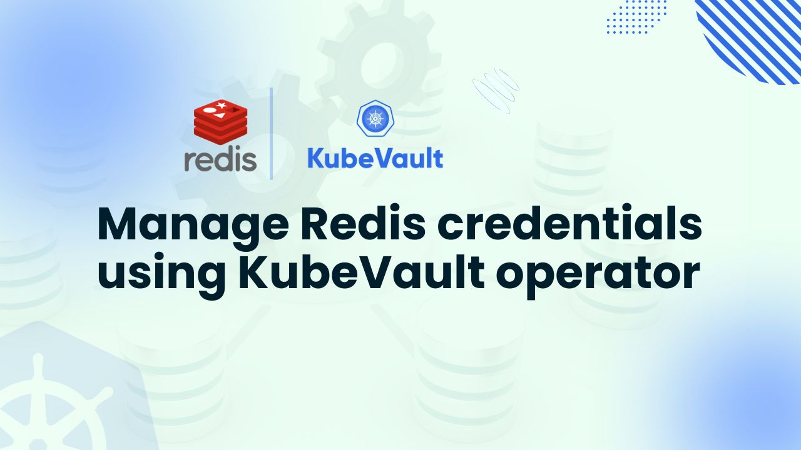

# Manage Redis credentials using KubeVault operator



In the modern landscape of cloud-native applications, secure storage of sensitive information such as Redis credentials, API keys, passwords, and certificates is essential. HashiCorp Vault offers solid secret capabilities, and combined with support for Kubernetes, it is managed effortlessly with the KubeVault operator. KubeVault facilitates cloud-native applications by offering a production-grade Kubernetes operator for automating, scaling, and protecting secret storage.

In this article, we will show you how to store and manage Redis credentials using KubeVault operator. You will see how to store and get Redis credentials from the Vault in a secure and efficient manner. Whether you're a security expert, a cloud architect, or a DevOps professional, this tutorial will guide you through the necessary steps to deploy a secure solution for managing Redis secrets in your Kubernetes setup.

## Why Vault in Kubernetes

HashiCorp Vault is a robust open-source secrets management tool designed to protect, store, and manage access to sensitive data, such as database credentials, API keys, passwords, and certificates. It enhances security by offering audit logging, dynamic secrets, access control, and encryption.

While Kubernetes provides a built-in Secrets API, it lacks strong encryption, granular access control, and automatic credential rotation. Vault addresses these limitations by offering end-to-end encryption, dynamic secret generation, and fine-grained policy-based access management. It also supports various authentication mechanisms, including Kubernetes service accounts, AppRole, and OIDC, ensuring secure access to sensitive information. Vault's audit logging and monitoring capabilities help organizations meet compliance requirements.

By running Vault in Kubernetes, particularly through the KubeVault Operator, organizations can seamlessly manage Redis credentials using KubeVault Operator without the need for complex manual processes. The KubeVault Operator integrates with Kubernetes workloads, allowing applications to retrieve credentials dynamically without code modification. This improves security, automation, and scalability while lowering operational overhead.

Using KubeVault to manage Redis credentials ensures enhanced security, automatic secret rotation, and simplified management, providing a secure and efficient solution for cloud-native applications.

## Deploy Vault on Kubernetes
### Pre-requisites
To deploy Vault in Kubernetes, we first set up the environment using KubeVault Operator. Along with having a basic understanding of [Vault]((https://www.vaultproject.io/)), you should also be familiar with Kubernetes terminology such as cluster, pod, service, and secret. Here, we'll build our Kubernetes cluster using [Kind]((https://kubernetes.io/docs/tasks/tools/#kind)). [Helm](https://helm.sh/docs/intro/install/) must also be installed on our Kubernetes cluster.

We'll now deploy HashiCorp Vault in Kubernetes using [KubeVault](https://kubevault.com/). However, you need to make sure that KubeVault is already set up in your Kubernetes cluster before you begin. A license is required to use KubeVault on a Kubernetes cluster, and it is available for free from the [Appscode License Server](https://license-issuer.appscode.com/). The Kubernetes cluster ID is required in order to obtain this license. You can use the command we've included below to find this ID.

```bash
$ kubectl get ns kube-system -o jsonpath='{.metadata.uid}'
e5b4a1a0-5a67-4657-b370-db7200108cae
```

After providing the necessary information and hitting the submit button, the license server will email a "license.txt" file. To install KubeVault, run the following commands:

```bash
$ helm install kubevault oci://ghcr.io/appscode-charts/kubevault \
  --version v2025.2.10 \
  --namespace kubevault --create-namespace \
  --set-file global.license=/path/to/the/license.txt \
  --wait --burst-limit=10000 --debug
```


Verify the installation by the following command:

```bash
$ kubectl get pods --all-namespaces -l "app.kubernetes.io/instance=kubevault"
NAMESPACE   NAME                                                  READY   STATUS    RESTARTS   AGE
kubevault   kubevault-kubevault-operator-f89555d55-rwf49          1/1     Running   0          64m
kubevault   kubevault-kubevault-webhook-server-6497bb6d69-4wvpr   1/1     Running   0          64m
``` 
Within a short time all the pods in kubevault namespace will start running. If all pod statuses are running, we can move on to the next phase.

For any confusion regarding KubeVault installation, you can follow the [KubeVault-Setup](https://kubevault.com/docs/latest/setup/) page.

### Create a Namespace
After that, we'll create a new namespace in which we will deploy Vault Server. In this case, we have created vault-demo namespace, but you can create namespace with any name that you want. To create the namespace, we can use the following command:

```bash
$ kubectl create namespace demo
namespace/demo created
``` 

### Deploy VaultServer via Kubernetes KubeVault operator
We need to create a yaml configuration to deploy HashiCorp Vault Server on Kubernetes. We will apply the following yaml:

```yaml
apiVersion: kubevault.com/v1alpha2
kind: VaultServer
metadata:
  name: vault
  namespace: demo
spec:
  allowedSecretEngines:
    namespaces:
      from: All
  version: 1.18.4
  replicas: 3
  backend:
    raft:
      storage:
        storageClassName: "standard"
        resources:
          requests:
            storage: 1Gi
  unsealer:
    secretShares: 5
    secretThreshold: 3
    mode:
      kubernetesSecret:
        secretName: vault-keys
  terminationPolicy: WipeOut
```

In this yaml,

- `spec.replicas` specifies the number of Vault nodes to deploy. It has to be a positive number. Note: Amazon EKS does not support HA for Vault. As we using Amazon EKS as our backend it has to be 1.
- `spec.version` specifies the name of the VaultServerVersion CRD. This CRD holds the image name and version of the Vault, Unsealer, and Exporter.
- `spec.allowedSecretEngines` defines the Secret Engine informations which to be granted in this Vault Server.
- `spec.backend` is a required field that contains the Vault backend storage configuration.
- `spec.unsealer` specifies Unsealer configuration. Unsealer handles automatic initializing and unsealing of Vault.
- `spec.terminationPolicy` field is Wipeout means that vault will be deleted without restrictions. It can also be “Halt”, “Delete” and “DoNotTerminate”. Learn More about these [HERE](https://kubevault.com/docs/v2025.2.10/concepts/vault-server-crds/vaultserver/#specterminationpolicy).

We will save this yaml configuration to `vault.yaml`. Then create the above HashiCorp Vault Server object.

```bash
$ kubectl apply -f vault.yaml
vaultserver.kubevault.com/vault created
```

This will create a `VaultServer` custom resource. The KubeVault Kubernetes Operator will watch this and create three HashiCorp Vault Server pods in the specified namespace.
If all the above steps are handled correctly and the Vault is deployed, you will see that the following objects are created:

```bash
$ kubectl get pod,vaultserver -n demo
NAME                     READY   STATUS    RESTARTS   AGE
pod/vault-0              2/2     Running   0          7m5s
pod/vault-1              2/2     Running   0          6m39s
pod/vault-2              2/2     Running   0          6m15s

NAME                              REPLICAS   VERSION   STATUS   AGE
vaultserver.kubevault.com/vault   3          1.18.4    Ready    7m29s
```

We have successfully deployed Vault in Kubernetes with the Kubernetes KubeVault operator. Now, we will connect to the deployed Vault Server and verify whether it is usable or not. First, check the status,

```bash
$ kubectl get vaultserver -n demo
NAME    REPLICAS   VERSION   STATUS   AGE
vault   3          1.12.1    Ready    5m48s
```

From the output above, we can see that the `VaultServer` is ready to use.

# Install KubeDB on Kubernetes

To set up KubeDB in our Kubernetes cluster, we need a license. Through the Appscode License Server, we can get a free enterprise license. We must provide our Kubernetes cluster ID to obtain a license. Run the following command below to get the cluster ID.

```bash
$ kubectl get ns kube-system -o jsonpath='{.metadata.uid}'
e5b4a1a0-5a67-4657-b370-db7200108cae
```

The license server will email us with a “license.txt” file attached after we provide the necessary data. Run the following commands listed below to install KubeDB.

```bash
$ helm install kubedb oci://ghcr.io/appscode-charts/kubedb \
  --version v2025.4.30 \
  --namespace kubedb --create-namespace \
  --set-file global.license=/path/to/the/license.txt \
  --wait --burst-limit=10000 --debug
```

Verify the installation by the following command,

```bash
kubectl get pods --all-namespaces -l "app.kubernetes.io/instance=kubedb"
NAMESPACE   NAME                                           READY   STATUS    RESTARTS   AGE
kubedb      kubedb-kubedb-autoscaler-0                     1/1     Running   0          6m3s
kubedb      kubedb-kubedb-ops-manager-0                    1/1     Running   0          6m3s
kubedb      kubedb-kubedb-provisioner-0                    1/1     Running   0          6m3s
kubedb      kubedb-kubedb-webhook-server-fb76b7889-qf4ng   1/1     Running   0          6m3s
kubedb      kubedb-petset-5dbd674f4b-hnmwj                 1/1     Running   0          6m3s
kubedb      kubedb-sidekick-6756758dd6-zl5w5               1/1     Running   0          6m3s

```

# Create a Redis server

We need to create a yaml manifest to install Redis on Kubernetes. And we will apply this yaml below,

```bash
apiVersion: kubedb.com/v1
kind: Redis
metadata:
  name: redis-quickstart
  namespace: demo
spec:
  version: 6.2.14
  storageType: Durable
  storage:
    storageClassName: "standard"
    accessModes:
      - ReadWriteOnce
    resources:
      requests:
        storage: 1Gi
  deletionPolicy: WipeOut
```

We will save this yaml configuration to redis.yaml. Then create the above Redis object.

```bash
$ kubectl apply -f redis.yaml
redis.kubedb.com/redis-quickstart created
```

If all the above steps are handled correctly and the Redis is deployed, you will see that the following objects are created:

```bash
$ kubectl get pod,redis -n demo
NAME                      READY   STATUS    RESTARTS   AGE
pod/redis-quickstart-0    1/1     Running   0          2m59s


NAME                                VERSION   STATUS   AGE
redis.kubedb.com/redis-quickstart   6.2.14    Ready    3m2s

```

## Manage Redis credentials using KubeVault

### Enable and Configure Redis Secret Engine

When a [SecretEngine](/docs/v2025.5.30/concepts/secret-engine-crds/secretengine) crd object is created, the KubeVault operator will enable a secret engine on specified path and configure the secret engine with given configurations.

A sample SecretEngine object for the Redis secret engine:

```yaml
apiVersion: engine.kubevault.com/v1alpha1
kind: SecretEngine
metadata:
  name: redis-secret-engine
  namespace: demo
spec:
  vaultRef:
    name: vault
    namespace: demo
  redis:
    databaseRef:
      name: redis-quickstart
      namespace: demo
    pluginName: "redis-database-plugin"
```

Let's deploy SecretEngine:

```bash
$ kubectl apply -f redis-secretengine.yaml
secretengine.engine.kubevault.com/redis-secret-engine created
```

Wait till the status become `Success`:

```bash
$ kubectl get secretengine -n demo
NAME                  STATUS    AGE
redis-secret-engine   Success   10s
```

Since the status is `Success`, the Redis secret engine is enabled and successfully configured. You can use `kubectl describe secretengine -n <namepsace> <name>` to check for error events, if any.

### Create Redis Role

By using [RedisRole](/docs/v2025.5.30/concepts/secret-engine-crds/database-secret-engine/redisrole), you can create a [role](https://www.vaultproject.io/docs/secrets/databases/redis#setup) on the Vault server in Kubernetes native way.

A sample RedisRole object is given below:

```yaml
apiVersion: engine.kubevault.com/v1alpha1
kind: RedisRole
metadata:
  name: rd-role
  namespace: demo
spec:
  secretEngineRef:
    name: redis-secret-engine
  creationStatements:
    - '["~*", "+@read","+@write"]'
  defaultTTL: 1h
  maxTTL: 24h
```

Let's deploy RedisRole:

```bash
$ kubectl apply -f redisrole.yaml
redisrole.engine.kubevault.com/rd-role created

$ kubectl get redisrole -n demo
NAME      STATUS    AGE
rd-role   Success   34m
```

You can also check from Vault that the role is created.
To resolve the naming conflict, name of the role in Vault will follow this format: `k8s.{clusterName}.{metadata.namespace}.{metadata.name}`.

> Don't have Vault CLI? Download and configure it as described [here](/docs/v2025.5.30/guides/vault-server/vault-server#enable-vault-cli)

```bash
$ vault secrets list
Path                 Type         Accessor              Description
you-database-path    database     database_cac6c5ee     n/a


$ vault list your-database-path/roles
Keys
----
k8s.-.demo.rd-role

$ vault read your-database-path/roles/k8s.-.demo.rd-role
Key                      Value
---                      -----
creation_statements      [["~*", "+@read","+@write"]]
credential_type          password
db_name                  k8s.-.db.redis-quickstart
default_ttl              1h
max_ttl                  24h
renew_statements         []
revocation_statements    []
rollback_statements      []
```

If we delete the Redis, then the respective role will be deleted from the Vault.

```bash
$ kubectl delete redisrole -n demo rd-role
redisrole.engine.kubevault.com "rd-role" deleted
```

Check from Vault whether the role exists:

```bash
$ vault read your-database-path/roles/k8s.-.demo.rd-role
No value found at your-database-path/roles/k8s.-.demo.rd-role

$ vault list your-database-path/roles
No value found at your-database-path/roles/
```

### Generate Redis credentials

Here, we are going to make a request to Vault for Redis credentials by creating `redis-access-req` SecretAccessRequest in `demo` namespace.

```yaml
apiVersion: engine.kubevault.com/v1alpha1
kind: SecretAccessRequest
metadata:
  name: redis-access-req
  namespace: demo
spec:
  roleRef:
    kind: RedisRole
    name: rd-role
    namespace: demo
  subjects:
    - kind: ServiceAccount
      name: demo-sa
      namespace: demo
```

Here, `spec.roleRef` is the reference of Redis against which credentials will be issued. `spec.subjects` is the reference to the object or user identities a role binding applies to it will have read access of the credential secret.

Now, we are going to create SecretAccessRequest.

```bash
$ kubectl apply -f redisSecretAccessRequest.yaml
secretaccessrequest.engine.kubevault.com/redis-access-req created

$ kubectl get secretaccessrequest -n demo
NAME               AGE
redis-access-req   72m
```

Database credentials will not be issued until it is approved. The KubeVault operator will watch for the approval in the `status.conditions[].type` field of the request object. You can use [KubeVault CLI](https://github.com/kubevault/cli), a [kubectl plugin](https://kubernetes.io/docs/tasks/extend-kubectl/kubectl-plugins/), to approve or deny SecretAccessRequest.

```bash
# using KubeVault CLI as kubectl plugin to approve request
$ kubectl vault approve secretaccessrequest redis-access-req -n demo
secretaccessrequests redis-access-req approved


$ kubectl get secretaccessrequest -n demo redis-access-req -o yaml
apiVersion: engine.kubevault.com/v1alpha1
kind: SecretAccessRequest
metadata:
  annotations:
    kubectl.kubernetes.io/last-applied-configuration: |
      {"apiVersion":"engine.kubevault.com/v1alpha1","kind":"SecretAccessRequest","metadata":{"annotations":{},"name":"redis-access-req","namespace":"demo"},"spec":{"roleRef":{"kind":"RedisRole","name":"rd-role","namespace":"demo"},"subjects":[{"kind":"ServiceAccount","name":"demo-sa","namespace":"demo"}]}}
    vaultservers.kubevault.com/name: vault
    vaultservers.kubevault.com/namespace: demo
  creationTimestamp: "2025-07-03T11:30:56Z"
  finalizers:
  - kubevault.com
  generation: 1
  name: redis-access-req
  namespace: demo
  resourceVersion: "7787"
  uid: 4df341ef-f0f1-436c-9ade-935810100ae5
spec:
  roleRef:
    kind: RedisRole
    name: rd-role
    namespace: demo
  subjects:
  - kind: ServiceAccount
    name: demo-sa
    namespace: demo
status:
  conditions:
  - lastTransitionTime: "2025-07-03T11:31:33Z"
    message: 'This was approved by: kubectl vault approve secretaccessrequest'
    observedGeneration: 1
    reason: KubectlApprove
    status: "True"
    type: Approved
  - lastTransitionTime: "2025-07-03T11:31:33Z"
    message: The requested credentials successfully issued.
    observedGeneration: 1
    reason: SuccessfullyIssuedCredential
    status: "True"
    type: Available
  lease:
    duration: 1h0m0s
    id: k8s.2ec438c7-0710-4122-a356-5b96a362e9aa.redis.demo.redis-secret-engine/creds/k8s.2ec438c7-0710-4122-a356-5b96a362e9aa.demo.rd-role/4ZKpRUWRsJYxDmfXPWJp9rwj
    renewable: true
  observedGeneration: 1
  phase: Approved
  secret:
    name: redis-access-req-vhy8vx
    namespace: demo
```

Once SecretAccessRequest is approved, the KubeVault operator will issue credentials from Vault and create a secret containing the credential. It will also create a role and rolebinding so that `spec.subjects` can access secret. You can view the information in the `status` field.

```bash
$ kubectl get secretaccessrequest redis-access-req -n demo -o json | jq '.status'
{
  "conditions": [
    {
      "lastTransitionTime": "2025-07-03T11:31:33Z",
      "message": "This was approved by: kubectl vault approve secretaccessrequest",
      "observedGeneration": 1,
      "reason": "KubectlApprove",
      "status": "True",
      "type": "Approved"
    },
    {
      "lastTransitionTime": "2025-07-03T11:31:33Z",
      "message": "The requested credentials successfully issued.",
      "observedGeneration": 1,
      "reason": "SuccessfullyIssuedCredential",
      "status": "True",
      "type": "Available"
    }
  ],
  "lease": {
    "duration": "1h0m0s",
    "id": "k8s.2ec438c7-0710-4122-a356-5b96a362e9aa.redis.demo.redis-secret-engine/creds/k8s.2ec438c7-0710-4122-a356-5b96a362e9aa.demo.rd-role/4ZKpRUWRsJYxDmfXPWJp9rwj",
    "renewable": true
  },
  "observedGeneration": 1,
  "phase": "Approved",
  "secret": {
    "name": "redis-access-req-vhy8vx",
    "namespace": "demo"
  }
}


$ kubectl get secret -n demo redis-access-req-vhy8vx -o yaml
apiVersion: v1
data:
  password: aVRYcU5ZRE1HU3BTWnpINDVRQS0=
  username: Vl9LVUJFUk5FVEVTLURFTU8tVkFVTFRfSzhTLjJFQzQzOEM3LTA3MTAtNDEyMi1BMzU2LTVCOTZBMzYyRTlBQS5ERU1PLlJELVJPTEVfUEtLR09VTkRHRk9CUk1VS0lSWjBfMQ==
kind: Secret
metadata:
  creationTimestamp: "2025-07-03T11:31:33Z"
  name: redis-access-req-vhy8vx
  namespace: demo
  ownerReferences:
  - apiVersion: engine.kubevault.com/v1alpha1
    blockOwnerDeletion: true
    controller: true
    kind: SecretAccessRequest
    name: redis-access-req
    uid: 4df341ef-f0f1-436c-9ade-935810100ae5
  resourceVersion: "7783"
  uid: cb3884a2-69ae-4b96-8c45-f4969ab8495d
type: Opaque
```

If SecretAccessRequest is deleted, then credential lease (if any) will be revoked.

```bash
$ kubectl delete secretaccessrequest -n demo redis-access-req-vhy8vx
secretaccessrequest.engine.kubevault.com "redis-access-req-vhy8vx" deleted
```

If SecretAccessRequest is `Denied`, then the KubeVault operator will not issue any credential.

```bash
$ kubectl vault deny secretaccessrequest redis-access-req-vhy8vx -n demo
  Denied
```

## Conclusion

In conclusion, using KubeVault to integrate HashiCorp Vault with Kubernetes provides a secure and efficient method to manage Redis credentials using KubeVault in a cloud-native environment. Combining Vault’s robust security features with Kubernetes clusters ensures that your Redis credentials, along with other sensitive information, are securely stored and accessed. By leveraging KubeVault, you simplify secret management, automate deployment, and integrate seamlessly with Kubernetes applications.

This article has covered the essential concepts of Vault, its integration with Kubernetes, and the process of managing Redis credentials using KubeVault. From setting up Vault in Kubernetes to configuring secret engines and granting secure access, you now have a complete understanding of how to manage Redis credentials using KubeVault securely in a Kubernetes environment.