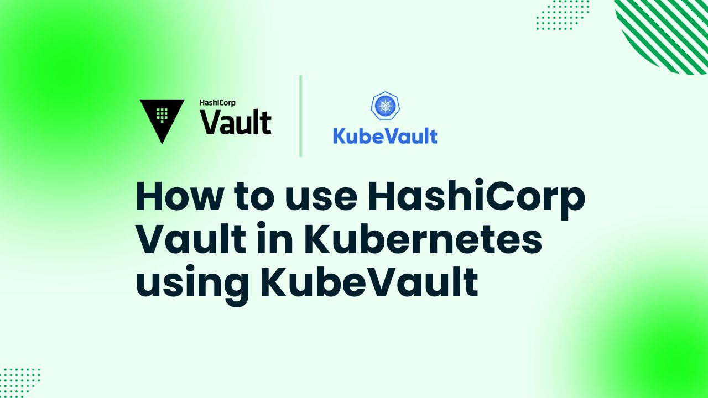

# How to use HashiCorp Vault in Kubernetes using KubeVault



Securing sensitive data such as API keys, passwords, and certificates takes top priority in the cloud-native scene of today. Powerful secrets management tool [HashiCorp Vault](https://www.vaultproject.io/) enables companies to safely save and manage data. But running Vault in Kubernetes requires an additional tool—[KubeVault](https://kubevault.com/).

KubeVault is an operator that automates HashiCorp Vault's deployment, management, and lifecycle inside Kubernetes clusters. It guarantees security, scalability, and automation for cloud-native apps as well as simplifies secret management.

This guide will walk over how to run and manage HashiCorp Vault in Kubernetes cluster using KubeVault. Whether your position is security professional, cloud architect, or DevOps engineer, this detailed guide will enable you to create a strong secret management system in Kubernetes.

## Why Vault in Kubernetes

HashiCorp Vault is a powerful open-source secrets management tool that is designed to protect, save, and manage access to private data including API keys, passwords, and certificates,  To improve security it offers audit logging, dynamic secrets, access control, and encryption.

Kubernetes has a built-in Secrets API, although it lacks strong encryption, fine-grained access control, and automatic secret rotation,  Through end-to--end encryption, dynamic secret generation, and flawless policy-based access management, vault solves these constraints. To guarantee safe access to critical data, it supports several authentication techniques including Kubernetes service accounts, AppRole, and OIDC. Vault's audit logging and monitoring features also enable companies to meet compliance criteria.

Running vault in Kubernetes helps companies to protect their applications without involving difficult manual procedures. By means of the Vault Agent Injector, it interacts with Kubernetes workloads which enables applications to dynamically retrieve secrets without changing their code. While operating overhead is lowered, this increases security, automation, and scalability.

Organizations achieve enhanced security, automated secret rotation, and simplified management by running HashiCorp Vault in Kubernetes using KubeVault, so guaranteeing a flawless, safe workflow for cloud-native applications.

## Deploy Vault on Kubernetes
### Pre-requisites
We have to configure the environment to deploy Vault in Kubernetes using KubeVault Operator. You need to have a Kubernetes cluster. You should have the basic knowledge of Kubernetes concepts like cluster, pod, service, secret and also have a primary knowledge of [Vault](https://www.vaultproject.io/). Here, we will use [Kind](https://kubernetes.io/docs/tasks/tools/#kind) to create our Kubernetes cluster. Also, we will need to install [Helm](https://helm.sh/docs/intro/install/) to our Kubernetes cluster.

In this article, We will use the [KubeVault](https://kubevault.com/) to deploy HashiCorp Vault in Kubernetes. But before starting, you must ensure that KubeVault is already installed in your Kubernetes cluster. For using KubeVault on Kubernetes cluster, a license is needed, which you can obtain for free from the [Appscode License Server](https://license-issuer.appscode.com/). To get this license, you'll need the Kubernetes cluster ID. You can find this ID by running the command we have provided below.

 
```bash
$ kubectl get ns kube-system -o jsonpath='{.metadata.uid}'
e5b4a1a0-5a67-4657-b370-db7200108cae
```

After providing the necessary information and hitting the submit button, the license server will email a "license.txt" file. To install KubeVault, run the following commands:

```bash
$ helm install kubevault oci://ghcr.io/appscode-charts/kubevault \
  --version v2025.2.10 \
  --namespace kubevault --create-namespace \
  --set-file global.license=/path/to/the/license.txt \
  --wait --burst-limit=10000 --debug
```


Verify the installation by the following command:

```bash
$ kubectl get pods --all-namespaces -l "app.kubernetes.io/instance=kubevault"
NAMESPACE   NAME                                                  READY   STATUS    RESTARTS   AGE
kubevault   kubevault-kubevault-operator-f89555d55-rwf49          1/1     Running   0          64m
kubevault   kubevault-kubevault-webhook-server-6497bb6d69-4wvpr   1/1     Running   0          64m
``` 
Within a short time all the pods in kubevault namespace will start running. If all pod statuses are running, we can move on to the next phase.

For any confusion regarding KubeVault installation, you can follow the [KubeVault-Setup](https://kubevault.com/docs/latest/setup/) page.

### Create a Namespace
After that, we'll create a new namespace in which we will deploy Vault Server. In this case, we have created vault-demo namespace, but you can create namespace with any name that you want. To create the namespace, we can use the following command:

```bash
$ kubectl create namespace vault-demo
namespace/vault-demo created
``` 

### Deploy VaultServer via Kubernetes KubeVault operator
We need to create a yaml configuration to deploy HashiCorp Vault Server on Kubernetes. We will apply the following yaml:

```yaml
apiVersion: kubevault.com/v1alpha2
kind: VaultServer
metadata:
  name: vault
  namespace: vault-demo
spec:
  allowedSecretEngines:
    namespaces:
      from: All
  version: 1.18.4
  replicas: 3
  backend:
    raft:
      storage:
        storageClassName: "standard"
        resources:
          requests:
            storage: 1Gi
  unsealer:
    secretShares: 5
    secretThreshold: 3
    mode:
      kubernetesSecret:
        secretName: vault-keys
  terminationPolicy: WipeOut
```

In this yaml,

- `spec.replicas` specifies the number of Vault nodes to deploy. It has to be a positive number. Note: Amazon EKS does not support HA for Vault. As we using Amazon EKS as our backend it has to be 1.
- `spec.version` specifies the name of the VaultServerVersion CRD. This CRD holds the image name and version of the Vault, Unsealer, and Exporter.
- `spec.allowedSecretEngines` defines the Secret Engine informations which to be granted in this Vault Server.
- `spec.backend` is a required field that contains the Vault backend storage configuration.
- `spec.unsealer` specifies Unsealer configuration. Unsealer handles automatic initializing and unsealing of Vault.
- `spec.terminationPolicy` field is Wipeout means that vault will be deleted without restrictions. It can also be “Halt”, “Delete” and “DoNotTerminate”. Learn More about these [HERE](https://kubevault.com/docs/v2025.2.10/concepts/vault-server-crds/vaultserver/#specterminationpolicy).

We will save this yaml configuration to `vault.yaml`. Then create the above HashiCorp Vault Server object.

```bash
$ kubectl create -f vault.yaml
vaultserver.kubevault.com/vault created
```

This will create a `VaultServer` custom resource. The KubeVault Kubernetes Operator will watch this and create three HashiCorp Vault Server pods in the specified namespace.
If all the above steps are handled correctly and the Vault is deployed, you will see that the following objects are created:

```bash
$ kubectl get all -n vault-demo
NAME          READY   STATUS    RESTARTS   AGE
pod/vault-0   2/2     Running   0          4m7s
pod/vault-1   2/2     Running   0          3m38s
pod/vault-2   2/2     Running   0          3m19s

NAME                                       TYPE          VERSION   AGE
appbinding.appcatalog.appscode.com/vault   VaultServer   1.12.1    4m7s

NAME                              REPLICAS   VERSION   STATUS   AGE
vaultserver.kubevault.com/vault   3          1.12.1    Ready    4m31s

NAME                                                            STATUS    AGE
vaultpolicy.policy.kubevault.com/vault-auth-method-controller   Success   2m55s

NAME                                                                   STATUS    AGE
vaultpolicybinding.policy.kubevault.com/vault-auth-method-controller   Success   2m53s
```

We have successfully deployed Vault in Kubernetes with the Kubernetes KubeVault operator. Now, we will connect to the deployed Vault Server and verify whether it is usable or not. First, check the status,

```bash
$ kubectl get vaultserver -n vault-demo
NAME    REPLICAS   VERSION   STATUS   AGE
vault   3          1.12.1    Ready    5m48s
```

From the output above, we can see that the `VaultServer` is ready to use. 

### Accessing Vault Server Through CLI

We will connect to the Vault by using Vault CLI. Therefore, we need to export the necessary environment variables and port-forward the service.

In one terminal port-forward the vault server service,

```bash
kubectl port-forward -n vault-demo service/vault 8200
Forwarding from 127.0.0.1:8200 -> 8200
Forwarding from [::1]:8200 -> 8200
```

We will connect to the HashiCorp Vault Server by using Vault CLI. Therefore, we need to export the necessary environment variables. So, in another terminal export the environment variables and interact with the vault server with Vault CLI,
```bash
$ export VAULT_ADDR=http://127.0.0.1:8200
$ export VAULT_TOKEN=(kubectl vault root-token get vaultserver vault -n vault-demo --value-only)

##Check Vault Status
$ vault status
Key                     Value
---                     -----
Seal Type               shamir
Initialized             true
Sealed                  false
Total Shares            5
Threshold               3
Version                 1.12.1
Build Date              2022-10-27T12:32:05Z
Storage Type            raft
Cluster Name            vault-cluster-b199935d
Cluster ID              5549e2d1-0181-0bfb-752b-59f94dac3325
HA Enabled              true
HA Cluster              https://vault-0.vault-internal:8201
HA Mode                 active
Active Since            2025-03-20T05:35:11.913829478Z
Raft Committed Index    429
Raft Applied Index      429
```

### Enabling KV SecretEngine

In the same terminal, let's go ahead create a [KV SecretEngine](https://developer.hashicorp.com/vault/docs/secrets/kv) in the HashiCorp VaultServer,
```bash
$ vault secrets enable -path=vault-demo -version=2 kv
vault secrets enable -path=vault-demo -version=2 kv

$ vault kv put vault-demo/db-cred username=appscode password=kubevault
===== Secret Path =====
vault-demo/data/db-cred

======= Metadata =======
Key                Value
---                -----
created_time       2025-03-20T05:47:25.811616153Z
custom_metadata    <nil>
deletion_time      n/a
destroyed          false
version            1

$ vault kv get vault-demo/db-cred
===== Secret Path =====
vault-demo/data/db-cred

======= Metadata =======
Key                Value
---                -----
created_time       2025-03-20T05:47:25.811616153Z
custom_metadata    <nil>
deletion_time      n/a
destroyed          false
version            1

====== Data ======
Key         Value
---         -----
password    kubevault
username    appscode
```

From the commands above we can see that Vault Server is working seamlessly. First, we have enabled a kv secret engine in the HashiCorp Vault Server. Then wrote and read some data in that secret engine.


## KubeVault Features
Kubernetes KubeVault Operator comes with a loads of features. Here, we will provide an overview of its features for your reference: 

* **HashiCorp Vault Server:** In this article, we have deployed a basic vault server for demo purpose. However, there are a lot of ways you can configure your vault server based on your specific needs. You can configure TLS, enable monitoring, use various backends, various secret engines and many more. You can find a detailed guide (HERE)[https://kubevault.com/docs/v2025.2.10/concepts/vault-server-crds/vaultserver/].

* **Secret Engine:** Here, we have used the Hashicorp Vault CLI to enable a [secret engine](https://developer.hashicorp.com/vault/docs/secrets). However, KubeVault Kubernetes Operator comes with a Kubernetes `CustomResourceDefinition` (CRD) called `SecretEngine` which is designed to automate the process of enabling and configuring secret engines in Vault in a Kubernetes native way. It supports secret engines for `AWS`, `Azure`, `GCP` and various databases, which you can use depending on your specific needs. You can check out the detailed guide [HERE](https://kubevault.com/docs/v2025.2.10/concepts/secret-engine-crds/secretengine/).

* **Vault Policy:**  Policies offer a declarative means of allowing or prohibiting access to specific Vault paths and actions. KubeVault operator provides a Kubernetes `CustomResourceDefinition` (CRD) named `VaultPolicy` which represents Vault server [policies](https://developer.hashicorp.com/vault/docs/concepts/policies) in a Kubernetes native way. [HERE](https://kubevault.com/docs/v2025.2.10/concepts/policy-crds/vaultpolicy/) is the link to a detailed guide of using `VaultPolicy`.

* **Disaster Recovery Strategies:** `KubeVault` uses [Stash](https://stash.run/) to backup and restore HashiCorp Vault. Stash by AppsCode is a cloud native data backup and recovery solution for Kubernetes workloads. To safely backup stateful apps to any cloud or on-premise storage backend (such as S3, GCS, Azure Blob storage, Minio, NetApp, Dell EMC, etc.), Stash uses [restic](https://github.com/restic/restic). You can find a detailed guide [HERE](https://kubevault.com/docs/v2025.2.10/concepts/backup-restore/overview/).

* **VaultOpsRequest:** KubeVault provides another Kubernetes Custom Resource Definitions (CRD) called `VaultOpsRequest` which provides a declarative configuration for Vault administrative operations like restart, reconfigure TLS etc. in a Kubernetes native way. For a detailed guide on how to use `VaultOpsRequest`, go [HERE](https://kubevault.com/docs/v2025.2.10/concepts/vault-ops-request/overview/).


## Conclusion

To sum up, using KubeVault to integrate HashiCorp Vault with Kubernetes provides a strong and safe way to handle secrets in a cloud-native environment. Combining Vault's strong security features with Kubernetes clusters guarantees that private information, such as API keys, passwords, and certificates, is safely stored and accessible. You can simplify secret management, automate deployment, and facilitate smooth integration with Kubernetes applications by using KubeVault. 

The primary concepts of Vault, its integration with Kubernetes, and how to run vault in Kubernetes have all been covered in this post. We've covered every necessary step for successfully deploying HashiCorp Vault in a Kubernetes environment, from installation to setting up secret engines and granting access to secure data.

Vault with KubeVault provide a complete solution that not only satisfies security needs but also improves operational efficiency as the value of protecting sensitive data—especially in microservices and containerized environments—becomes increasingly relevant. Together with Vault's strong access control systems, Kubernetes' scalability guarantees that your application stays safe as it expands.

It will assist you to simplify secret management, enhance your security posture, and lower administrative overhead whether you are running large, distributed systems or small-scale applications. Following the described guidelines will help you to improve the security of your Kubernetes environment and guarantee that your apps are scalable and safe.

Including KubeVault in your Kubernetes configuration will greatly enhance the way sensitive data is handled in your company while still allowing the flexibility and automation Kubernetes provides. This is a necessary tool that will help you keep ahead in implementing contemporary cloud-native technologies and procedures.